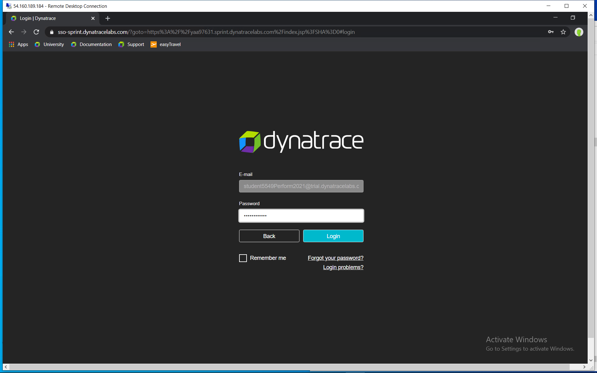
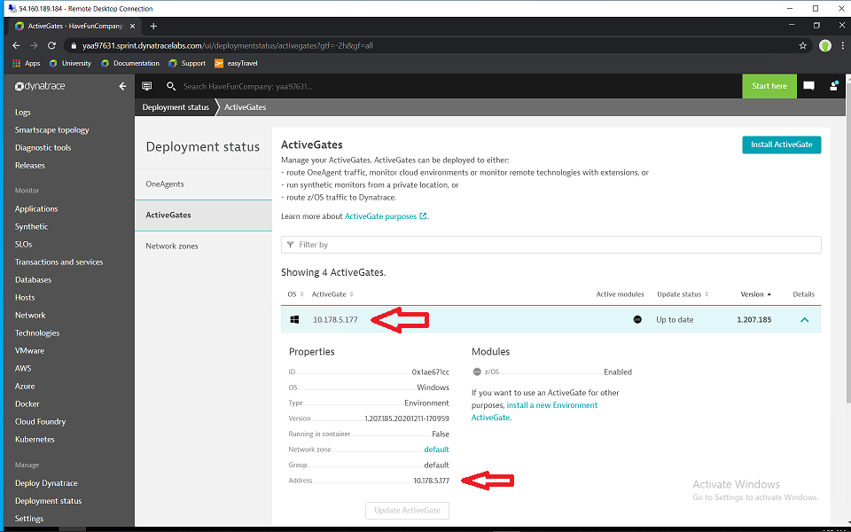

## Deployment and Customization

In this module you will learn how to deploy a Mainframe ActiveGate and zRemote and make the definitions on the Mainframe to connect an LPAR to this zRemote.

### Step 1: Open Dynatrace Tenant
- Open the Dynatrace tenant provided to you
- Login with the credentials provided to you



### Step 2: Install the Mainframe ActiveGate
- Select `Deploy Dynatrace` and click on `Install Active Gate`
- Select `Windows`
- Check `Route z/OS traffic to Dynatrace` (Step 1)
- Click on `Download Installer` (Step 2) OR Click on `Copy` and paste the download command into a DOS prompt, press `Enter`
- Wait for the download to finish (can take a while)
- Navigate to the Downloads folder in the DOS prompt
- `Copy` installation command from the Dynatrace Tenant (Step 3) and install with the default settings
- Click on `Show Deployment Status` after the Installation has been successful

  
- Note the IP-Address of YOUR Mainframe ActiveGate

### Step 3: Prepare and start the zDC
- Double click on the X3270 Session called `Perform` on the Desktop
- Logon to ISPF with `logon <userid>` using the Userid provided to you 
- Edit the SYSIN for the zDC parameters - `<userid>.CI.R070300.ZDCSYSIN`
- Provide the IP-Address of your Mainframe ActiveGate (from Step 2) and Port 8898 in the DTAGTCMD string
- Keep all other parameters as they are  
- Submit the zDC JCL - member ZDCJCL1 in dataset `<userid>.CI.R070300.JCL`
- Check in sdsf if the job AFVDZnnn is running 
- Browse the job spool to check if the zDC has connected properly to the zRemote

### Step 4: Prepare CICS transaction
- Submit the CICS JCL - member Cnnn5301 in dataset `<userid>.CI.R070300.JCL`
- Check in SDSF, if the job HVDACnnn is running 
- Double click on the X3270 Session called `Perform` on the Desktop again to open a second session
- Logon to CICS with `l HVDACnnn` 
- Click on Keypad and `Clr Scrn`
- Make a newcopy using `cemt s prog(ADKCOBOL) ne` 

### Step 5: Define the CICS transaction in Dynatrace
- Open your Dynatrace Tenant
- Navigate to `Settings -> Server Side Service Monitoring -> Deep Monitoring -> CICS, IMS and MQ Monitoring` 
- In section `Transaction Monitoring` click on `Add CICS transaction Start Id filter` and add transaction `DADC`
- Do not forget to `Save changes`

### Step 6: Trigger the Mainframe transaction 
- Use member AFDTRAN in `<userid>.JCL`
- Submit this and it will execute transaction `DADC` 20 times
- You will see these PurePaths as Requests under the CICS service (`Transactions and Services -> HVDACnnn -> View PurePaths')
- Go to `sdsf` and type `log` to browse the System Log
- At the bottom you will see messages like these (check those prefixed with your own CICS region `HVDACnnn`):
```
+HVDAC731 Africa                 
+HVDAC731 COBOL ADKCOB  complete.
+HVDAC731 Australia              
+HVDAC731 COBOL ADKCOB  complete.
+HVDAC731 Australia              
+HVDAC731 COBOL ADKCOB  complete.
+HVDAC731 Africa                 
+HVDAC731 COBOL ADKCOB  complete.
+HVDAC731 Australia              
+HVDAC731 COBOL ADKCOB  complete.
+HVDAC731 Africa                 
+HVDAC731 COBOL ADKCOB  complete.
+HVDAC731 America                
+HVDAC731 COBOL ADKCOB  complete.
+HVDAC731 Invalid                
+HVDAC731 COBOL ADKCOB  complete. 
```

### You've arrived
- You have successfully deployed Dynatrace and have defined and captured the CICS transaction, which will be used in the SDK Hands-On! 


