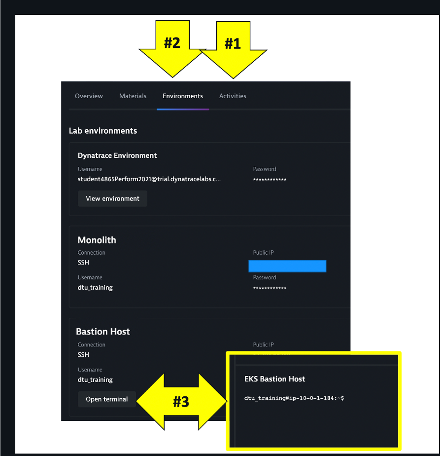
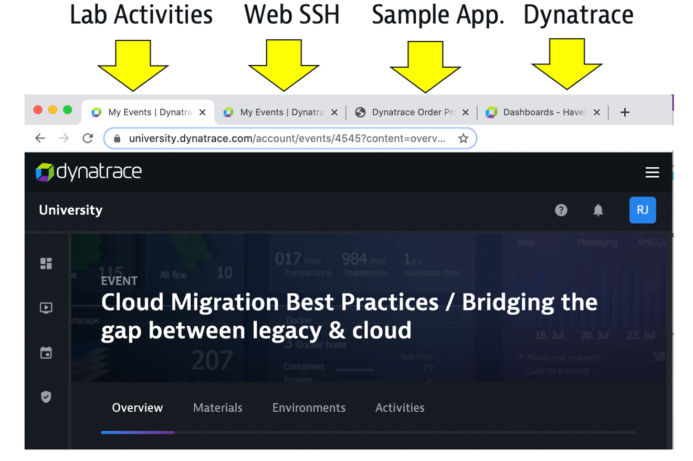

## Welcome

Welcome to the **Cloud Migration Best Practices / Bridging the gap between legacy & cloud** workshop.

In this session, you will learn what it takes to define and execute a migration strategy for a low-risk, smooth transition to the cloud.  Learn Dynatrace's advanced observability features that give you actionable insights every step of the way – from assessing, planning, migrating, and finally – optimization!  

### A few points

To make the most of the session, you should:
* Be able to run basic Unix commands
* Be familiar with basic cloud concepts
* Be familiar with containerization concepts such as Docker
* Please **ASK QUESTIONS** and **INTERACT**

## Dynatrace University Virtual Classroom

Referring to the picture below:

1. Lab activities are found in the `Activities` section

1. Your `Environments` page has the URL and credentials for your pre-provisioned workshop components and Dynatrace environment

1. **You will NOT have access to the AWS console**, but your `Environments` page has a built-in Web SSH Client for the Bastion Host.  Recommend ”duplicate” tab to have SSH in its own tab

## Workshop Prep

To keep yourself organized and to easily navigate across the various consoles and views, make a new browser window and maintain tabs for each of the following as you are requested to add them. Below is what you will eventually have:

