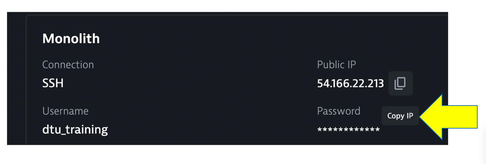

## Review sample app

To view the application, copy the public IP and open it up in a browser.   

## Sample app

Use the menu on on the home page to navigate around the application and notice the URL for key functionality.  You will see these URLs later as we analyze the application.

* Customer List = `customer/list.html`
* Customer Detail = `customer/5.html`
* Catalog List = `catalog/list.html`
* Catalog Search Form = `catalog/searchForm.html`
* Order List = `order/list.html`
* Order Form = `order/form.html`