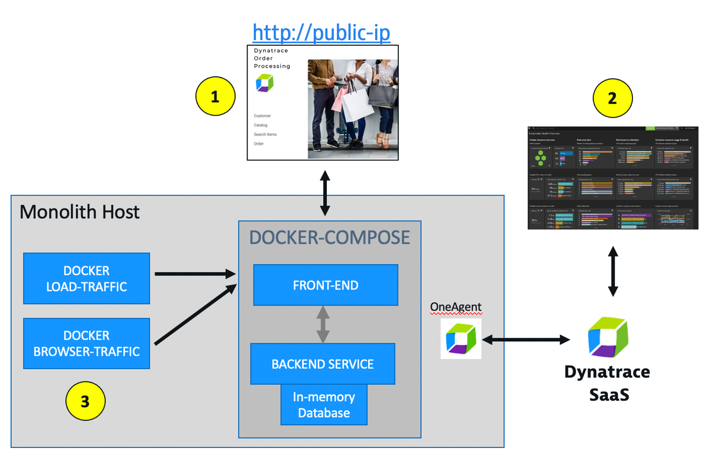
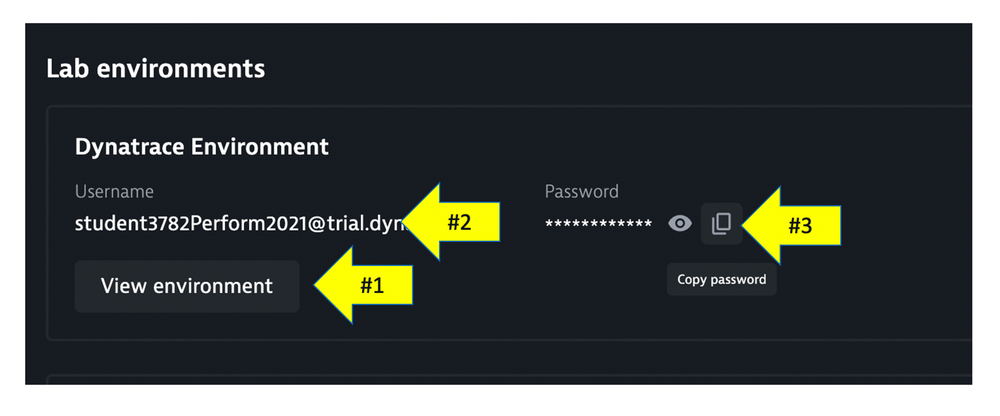
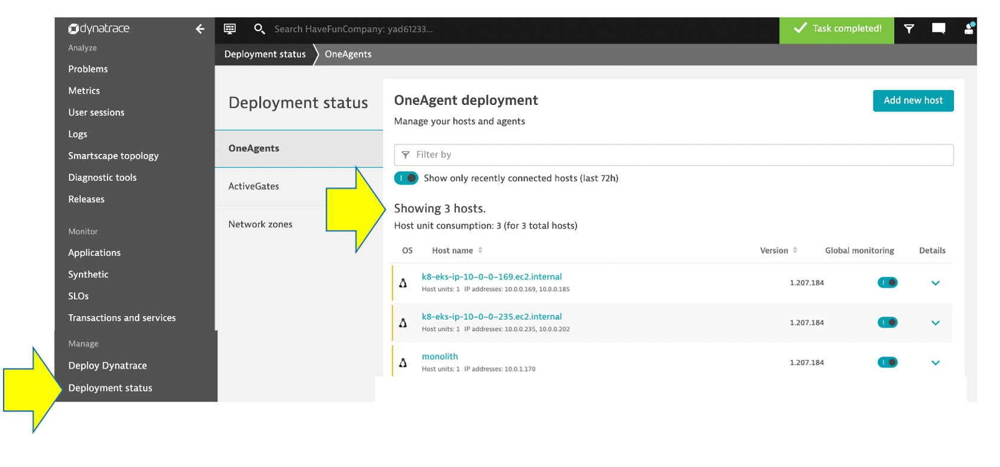
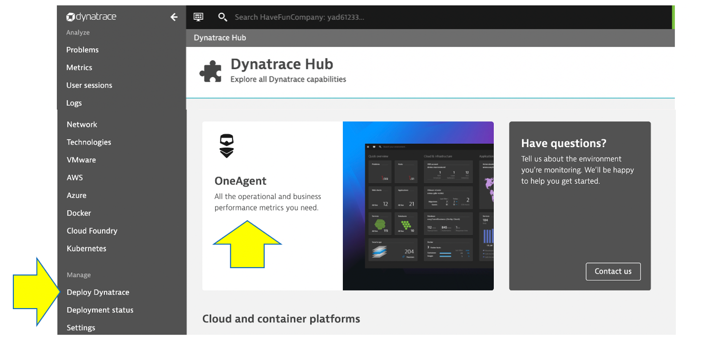

## Dynatrace Review

Referring to the picture below, here are the components for lab 1.

**#1 . Demo App**

Sample app representing a "monolith" architecture of a front and and backend.  The application was implemented as two Docker containers that we will review in this lab within Dynatrace.

**#2 . Dynatrace monitoring**

the Dynatrace OneAgent was preinstalled and is sending data to your Dynatrace SaaS environment.  We will review this next.

**#3 . Load generator process**

Two docker processes that loop to send simulated user traffic to the sample app.  You will not need to interact with these, they just run in the background.

## Log into Dynatrace 

To login, follow the steps defined in the picture below:

1. Click `View environment` that will open the login page to Dynatrace
1. Use the `Copy` button for the username
2. Use the `Copy` button for the password

## OneAgent

The host running the sample application was created by the Dynatrace University team using scripts to install and run the Sample Application as well as to install the Dynatrace OneAgent.

To see the running OneAgent, choose the `Deployment status` option from the left side menu to open the OneAgent deployment page.

💥 **TECHNICAL NOTE**: Dynatrace University has a few interfaces that run before the OneAgent was installed. So some warnings are OK.

To see how the OneAgent gets installed

1. Choose the `Deploy Dynatrace` option from the left side menu to open the OneAgent deployment page. 
1. Pick the `OneAgent` under the `Start monitoring` section.

1. Pick the `Download Agent` option to open the `Download agent` page.

1. On the `Download agent` page, pick the platform `Linux` to view the commands will download and run the OneAgent installer.  

Learn more about the various ways the OneAgent can be installed, check out the [Dynatrace documentation](https://www.dynatrace.com/support/help/setup-and-configuration/dynatrace-oneagent/)

