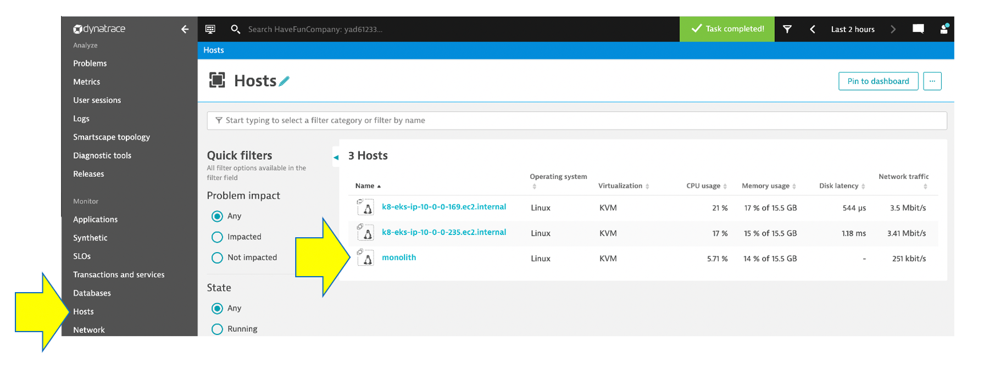
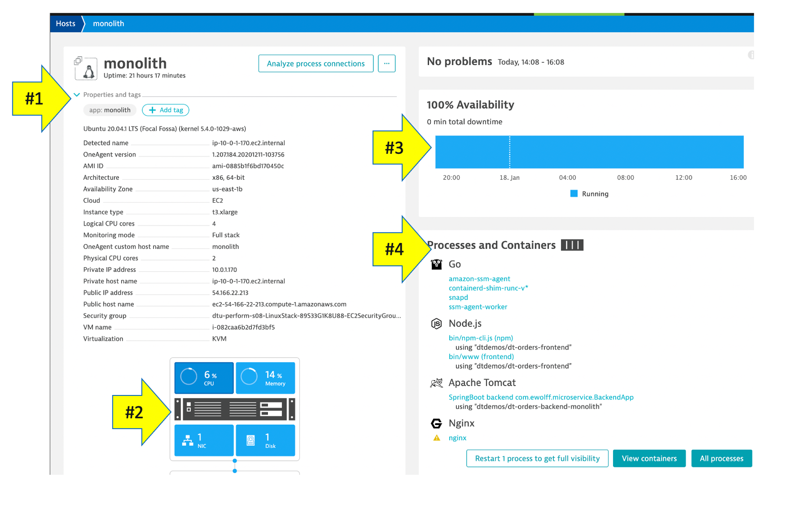

## Host view

In this next few sections, review what the OneAgent automatically discovered for the host, services, processes, and the complete dependency mapping for the sample application.  

## 👍 How this helps

As you plan your migration, each of these views will give insights in accessing the profile, consumption and dependencies to other systems and services.

### Review Hosts

From the left-side menu in Dynatrace choose **hosts** then click on the host with the name **monolith**.

💥 **TECHNICAL NOTE**: This host has this name since we added the option to set it during the OneAgent install process.  `/bin/sh Dynatrace-OneAgent-Linux-1.207.184.sh --set-host-name=monolith`  This is just [one of the ways](https://www.dynatrace.com/support/help/how-to-use-dynatrace/hosts/configuration/set-custom-host-names-in-dynamic-environments/) to customize host naming. 

On host page, you will see basic infrastructure information for the host.

1. Now expand the **Properties** section to see data about the host:
1. Host resource metrics (CPU, memory)
1. Host availability
1. Discovered processes. In this case most of which are Java applications running in Tomcat.

💥 **TECHNICAL NOTE**: 
Dynatrace University has an interface that runs on nginx which are installed before the OneAgent is, so a warning on ungix is OK.

### How Dynatrace monitors containers

Dynatrace hooks into containers and provides code for injecting OneAgent into containerized processes.

There’s no need to modify your Docker images, modify run commands, or create additional containers to enable Docker monitoring. Simply install OneAgent on your hosts that serve containerized applications and services. Dynatrace automatically detects the creation and termination of containers and monitors the applications and services contained within those containers.

You can read more about Dynatrace Docker Monitoring [here](https://www.dynatrace.com/support/help/technology-support/cloud-platforms/other-platforms/docker/basic-concepts/how-dynatrace-monitors-containers/) and technical details [here](https://www.dynatrace.com/support/help/technology-support/cloud-platforms/other-platforms/docker/monitoring/monitor-docker-containers)
