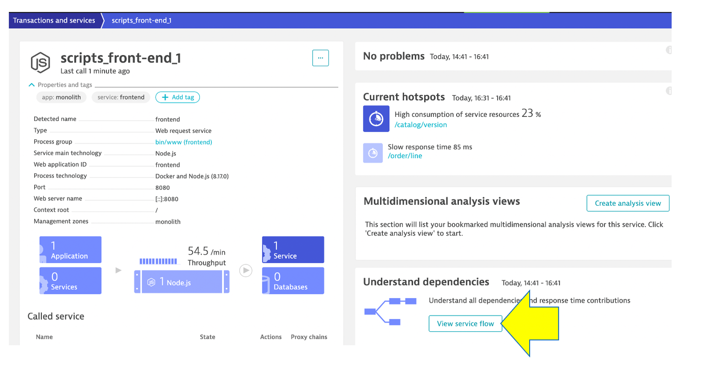
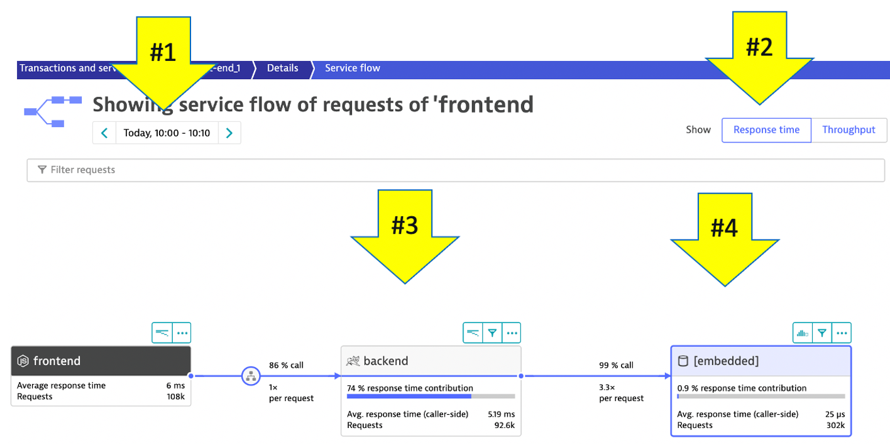
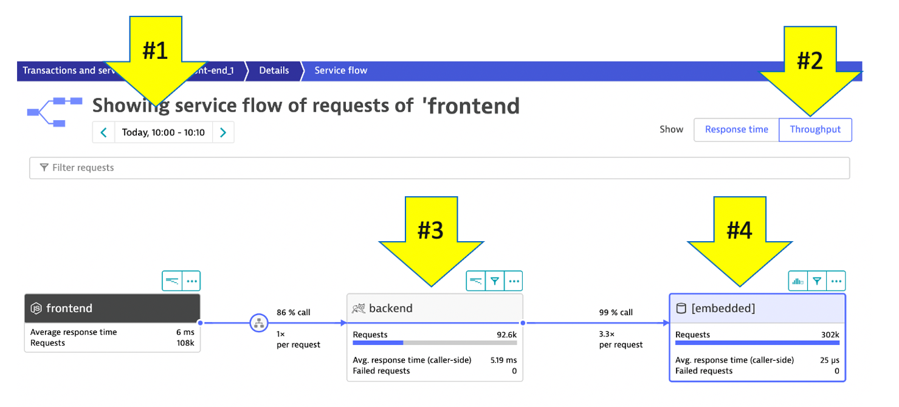

## Service Flow

We just saw one way to review process and service communication, but Let’s look at how Dynatrace understands your applications’ transactions from end to end. and visualizes through **Service Backtraces** and **Service flows**.

* With **Service flow**, you see the flow of service calls **FROM** a service, request, or their filtered subset. Along with the specific services that are triggered, you can also see how each component of a request contributes to the overall response time.

* With **Service backtrace**, you see the calls **TO** a service.,

## 👍 How this helps

As you plan your migration, it is important to gain a complete picture of interdependency to the rest of the environment architecture at host, processes, services, application perspectives. Since time is always scarce, being able to do this in a single place can shorten assessment timelines.

Knowing the type of access, executed statements, and amount of data transferred during regular hours of operation allows for better planning and prioritization of the move groups. In some cases, you may decide to not migrate this database in favor of other services or databases that are less complex to migrate due to fewer dependencies.

## Review Service Flow

Close the details page and go back to the `scripts_front-end_1` service page. 

From the `Understand dependencies` section on the right, click the `view service flow` button to see what it calls. 

## Response time perspective

You should now be on the **Service flow** page.

Right away, we can see how this application is structured:  

* Frontend calls backend
* Backend calls database

Refer to the numbers in the picture above:

1 . The timeframe defaults to 10 minutes but can be adjusted

2 . We are viewing the data from a **Response time perspective**. Shortly, we will review the **Throughput perspective**.

3 . Click on the boxes to expand the response time metrics. We can see that most of the response time, roughly 70%, is spent in the backend service.

4 . Even though there are roughly 3 calls to the database for every backend service request, only 2% of the response time is spent in the database. 

## Throughput perspective

Refer to the numbers in the picture above:

1 . The timeframe defaults to 10 minutes but can be adjusted

2 . Change to the **Throughput** perspective by clicking on the box

3 . Click on the boxes to expand the metrics to see the number of requests and average response times going to the BookingService

4 . We can see that roughly 85% of the calls to `backend` service and we can see the number of requests too.
