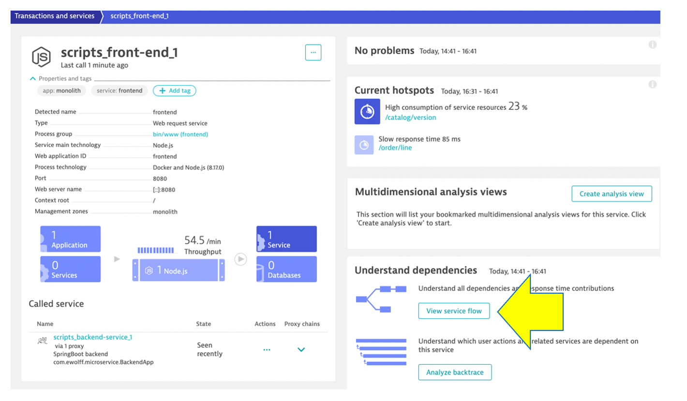

## Service Flow

We just saw one way to review process and service communication, but Let’s look at how Dynatrace understands your applications’ transactions from end to end. and visualizes through **Service Backtraces** and **Service flows**.

* With **Service backtrace**, you see the calls **TO** a service.,

* With **Service flow**, you see the flow of service calls **FROM** a service, request, or their filtered subset. Along with the specific services that are triggered, you can also see how each component of a request contributes to the overall response time.

As you plan your migration, it is important to gain a complete picture of interdependency to the rest of the environment architecture at host, processes, services, application perspectives. Since time is always scarce, being able to do this in a single place can shorten assessment timelines.

### Service backtrace

Dynatrace understands your applications transactions from end to end. This transactional insight is visualized several ways like the backtrace. The backtrace tree view represents the sequence of services that led to this service call, beginning with the page load or user action in the browser.

From the **scripts_backend-service_1** service, click on the **Analyze Backtrace** button.

You should be on the service backtrace page where you will see information for this specific service.

Follow the picture above to locate the services that were called in what order that called the **scripts_backend-service_1**

1 . The starting point is the **scripts_backend-service_1**

2 . **scripts_backend-service_1** is called by the **scripts_front-end_1**

3 . **scripts_front-end_1** is a where end user requests start and the user sessions get captured within the **My web application** by default.

### Service Flow

Now Let’s see another visualization called the service flow. 

### View the complete end to end flow 

Let’s now take a look at the transactions and Services by click on the `Transactions and services` left side Dynatrace menu.

There a lot of services in this list. To help manage this list a [Dynatrace auto-tagging rule](https://www.dynatrace.com/support/help/how-to-use-dynatrace/tags-and-metadata/) was added by the workshop scripts and we can now use a tag filter to make this list more manageable.

In the filter box, type `tag`, choose `app`, and the value of `monolith`. It should look like this:

You can now pick the `scripts_front-end_1` service to open the service page. From the `Understand dependencies` section on the right, click the `view service flow` button to see what it calls. 

# TODO -- UPDATE THIS SECTION ONCE FIX THE BACKEND APP TO NOT HAVE REST CALLS
