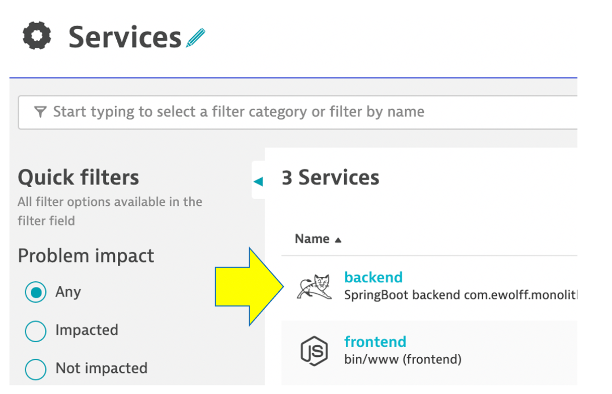
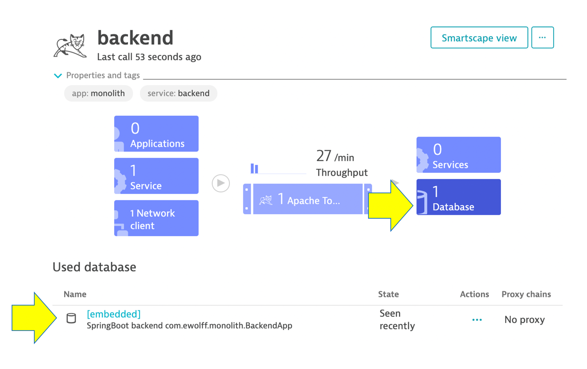
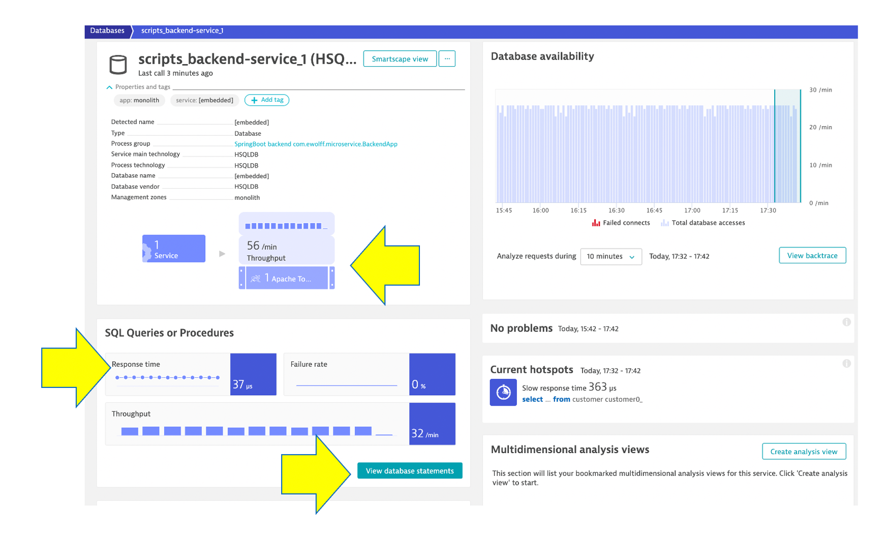

## Databases

As you plan your migration, Database observability is critical to a successful plan. Knowing the type of access, executed statements, and amount of data transferred during regular hours of operation allows for better migration planning and prioritization of the move groups. In some cases, you may decide to not migrate this database in favor of other services or databases that are less complex to migrate due to fewer dependencies.

## 👍 How this helps 

When monitoring database activity, Dynatrace shows you which database statements are executed most often and which statements take up the most time. You can also see which services execute the database statements what will be direct input to migration planning and prioritization of the move groups.

Dynatrace monitors all the popular database SQL Server, Oracle, MongoDB to name a few. See [Dynatrace documentation](https://www.dynatrace.com/platform/database-monitoring/) for more details on platform support.

## Review Database

To learn some out of the box features of Dynatrace, Let’s do a quick review the database that exist for the sample application.

From the transactions and Services menu, click on the `Transactions and services` left side Dynatrace menu.

Pick the `scripts_backend-scripts_1` service.

Now click on the **scripts_backend-service_1** database to open the database service page. 

💥 **TECHNICAL NOTE**: The sample application uses an [In memory Java relational database](http://hsqldb.org/).  On this page you can explore the database process metrics like writes, reads, and drill into database statements.

