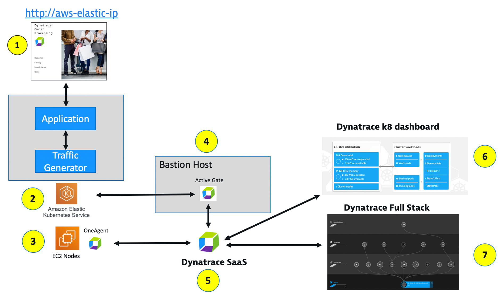

## Lab 2 Setup

Referring to the picture below, here are the components for lab 2.

**#1 . Demo App**

Sample app broken up as into "services" architecture of a frontend and backend services.  The application was implemented as two Docker containers that we will review in this lab within Dynatrace.

There are also the two docker processes that loop to send simulated user traffic to the sample app.  You will not need to interact with these, they just run in the background.

**#2 . Kubernetes**

AWS Elastic Kubernetes Service (EKS) is hosting the application

**#3 . Kubernetes Node Pool**

Two AWS EC2 instances.  The Dynatrace OneAgent was preinstalled and is sending data to your Dynatrace SaaS environment.  

**#4 . Dynatrace ActiveGate**

A Dynatrace ActiveGate was preinstalled on the bastin EC2 instances. This is requrired for the Kubernetes dashboard and sending data from the EKS Kubernetes cluster to your Dynatrace SaaS environment.  

**#5 . Dynatrace SaaS environment**

This is the same environment for all the labs.

**#6 . Dynatrace Kubernetes Dashboard**

Made possible by the Kubernetes integration setup and Dynatrace ActiveGate.

**#7 . Dynatrace Full Stack Information**

Make possible by the Dynatrace OneAgent that will automatically instrument each running pod in EKS.

