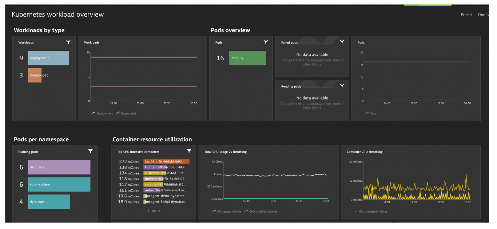
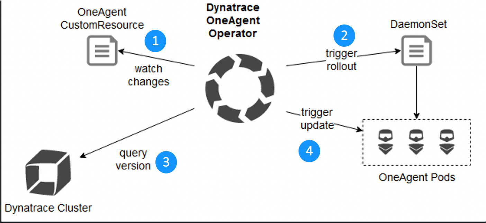

## Lab 2 Setup

Refer to the picture below, here are the components for lab 2.

1. **Demo App**

    Sample app broken up as into "services" architecture of a frontend and backend services.  The application was implemented as two Docker containers that we will review in this lab within Dynatrace.

    There are also the two processes that loop to send simulated user traffic to the sample app.  You will not need to interact with these, they just run in the background.

1. **Kubernetes**

    AWS Elastic Kubernetes Service (EKS) is hosting the application.  The Kubernetes cluster had the Dynatrace OneAgent Operator installed. (see below for more details)

1. **Kubernetes Node Pool**

    Two AWS EC2 instances that make up the Kubernetes cluster.  The Dynatrace OneAgent was preinstalled by the OneAgent operator and is sending data to your Dynatrace SaaS environment.  (see below for more details)

1. **Dynatrace SaaS environment**

    This is the same environment for all the labs.

1. **Dynatrace Kubernetes Dashboard**

    Made possible by the Kubernetes integration setup and Dynatrace ActiveGate.

1. **Dynatrace Full Stack Information**

    Make possible by the Dynatrace OneAgent that will automatically instrument each running pod in EKS.

## Monitoring Kubernetes

We are not going to get into the details of how it was all setup, but here are the two main underlying ways Dynatrace is doing the monitoring.  In the labs, we will review all the information that is collected. 

### 1) Kubernetes API

By providing Dynatrace access to the Kubernetes API, many additional insights are possible, for example, event tracking and over-commitment rate (resource requests vs. resources available).  Here is a custom dashboard showing some of the collected metrics.

### 2) Monitoring Kubernetes - OneAgent

Dynatrace supports full-stack monitoring from the application to the operating system layer using OneAgent. When OneAgent is installed on the host operating system, it automatically collects all relevant monitoring data, including load metrics, memory consumption, and logs—with no configuration required. Additionally, it discovers all processes running on the host and automatically activates instrumentation throughout the application stack.

Using OneAgent Operator, OneAgent can be automatically installed on every Kubernetes Node (DaemonSet), thereby ensuring all nodes are monitored when they join your cluster. While OneAgent Operator can be installed on most managed Kubernetes infrastructures, there may be cases where you don’t have access to the operating system layer. In this case, OneAgent Operator can be used to inject instrumentation into the pod (otherwise known as “application-only monitoring”).

Refer to the picture below for the OneAgent lifecycle:
1. Watches for custom resources of type OneAgent
1. Takes care of OneAgent deployment via DaemonSet
1. Check for new OneAgent versions
1. Updates OneAgent to the latest version available

## 👍 How this helps 

Kubernetes components like nodes and Pods come and go quickly. As this dynamic containerized world can cause errors and additional challenges for applications and their developers, Dynatrace is a monitoring system that’s designed to handle such dynamic infrastructure out-of-the-box. 

The Automatic agent management by Operator allows for every worker node have an agent deployed via the daemonset. As as result:

* Automatic agent update
* Automatic discovery : no image or container manipulation required
* Automated full stack monitoring: hosts, containers, processes, services, application
* Automatic capture of container and pod metadata
* Automated transaction tracing
* Container log monitoring
