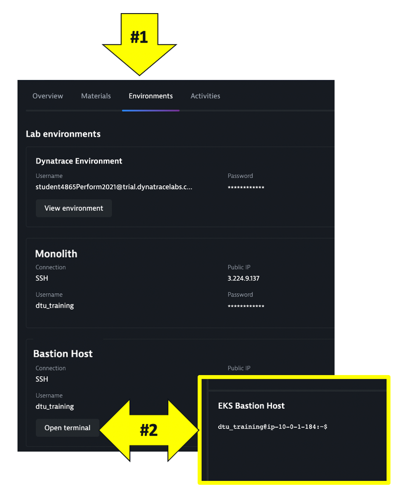
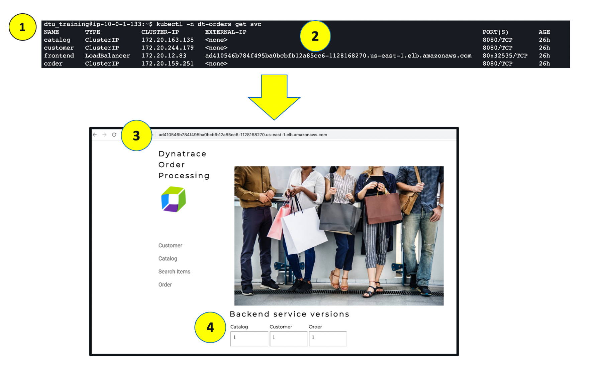

## View the Sample App 

To view the application, we need to get the AWS elastic IP for the running application.  To do this, we need to SSH into the bastion host and run one kubernetes command.


## SSH to bastion host



From the command prompt type this command

```
kubectl -n dt-order get svc
```

From the output, copy the entire value from `CLUSTER-IP` and open it in a browser.



💥 **TECHNICAL NOTE**: The application looks like this monolith, but notice how the home page shows the versions of the three running backend services. You will see these version will be updated as we deploy new versions of the backend services.

## Explore Sample app

Use the menu on on the home page to navigate around the application and notice the URL for key functionality.  You will see these URLs later as we analyze the application.

* Customer List = `customer/list.html`
* Customer Detail = `customer/5.html`
* Catalog List = `catalog/list.html`
* Catalog Search Form = `catalog/searchForm.html`
* Order List = `order/list.html`
* Order Form = `order/form.html`
