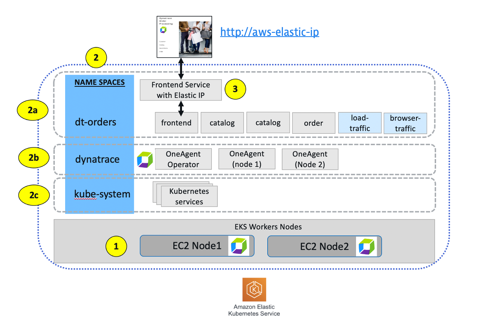

## Setup Review

Back in your bastion host, you will run a few `kubectl` commands against your environment.

Refer to the picture below as reference to the setup of Kubernetes



1. Nodes

    ```
    kubectl get nodes
    ```

    Copy the node name and run this command replacing 'ip-10-0-0-169.ec2.internal' with your node name.

    ```
    kubectl describe node ip-10-0-0-169.ec2.internal
    ```

2. Namespaces

    ```
    kubectl get ns
    ```

    Get pods in the namespace

    ```
    kubectl -n kube-system get pods
    kubectl -n dynatrace get pods
    kubectl -n dt-orders get pods
    ```

3. Services

    This is the command you ran earlier to the Sample App

    ```
    kubectl -n dt-orders get svc
    ```