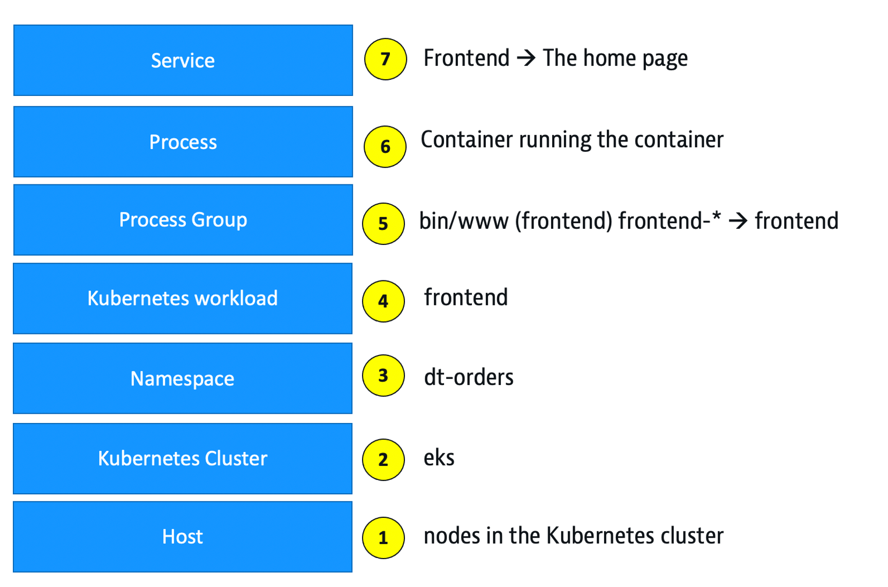
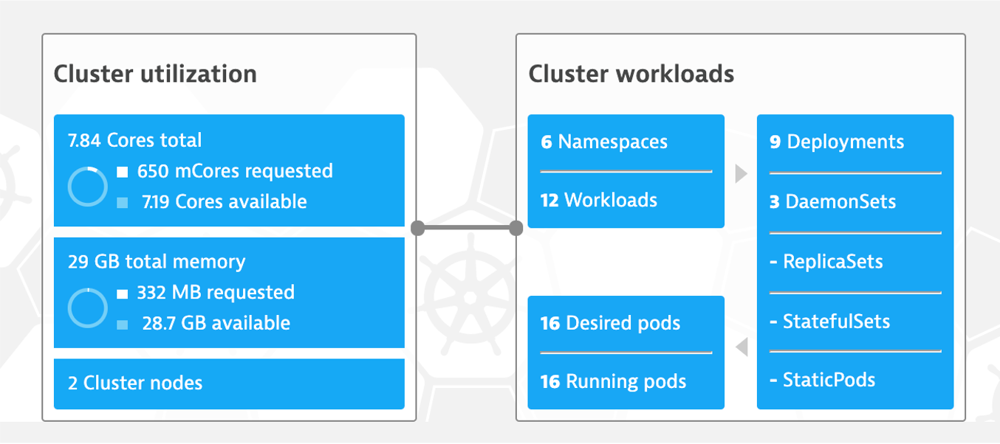
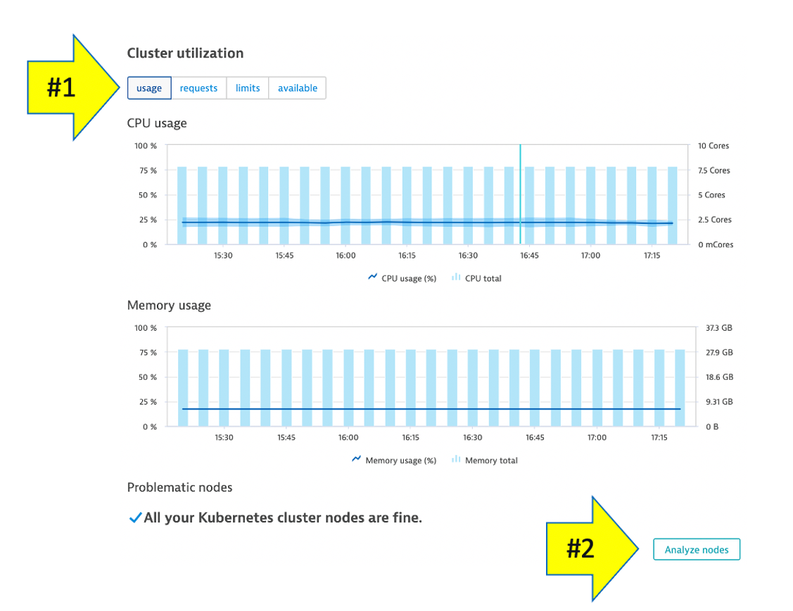
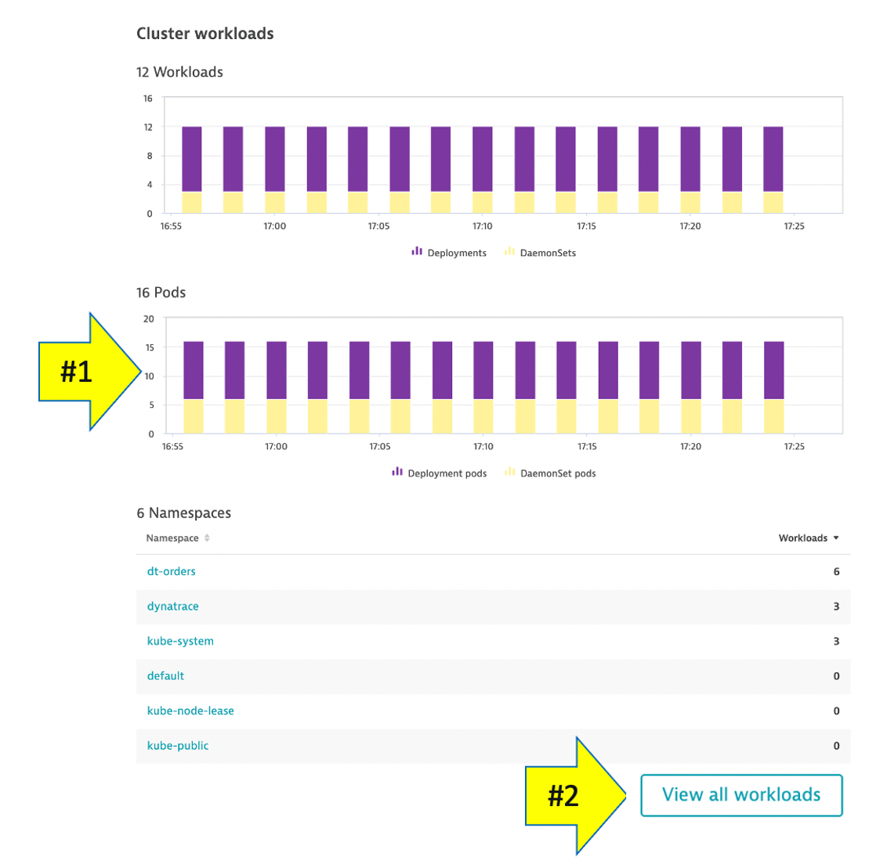
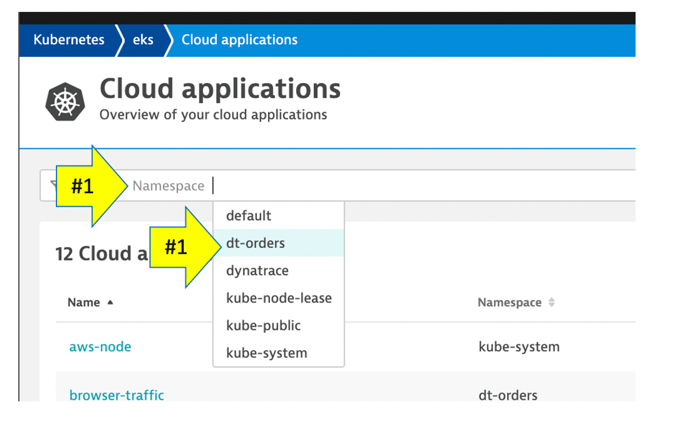
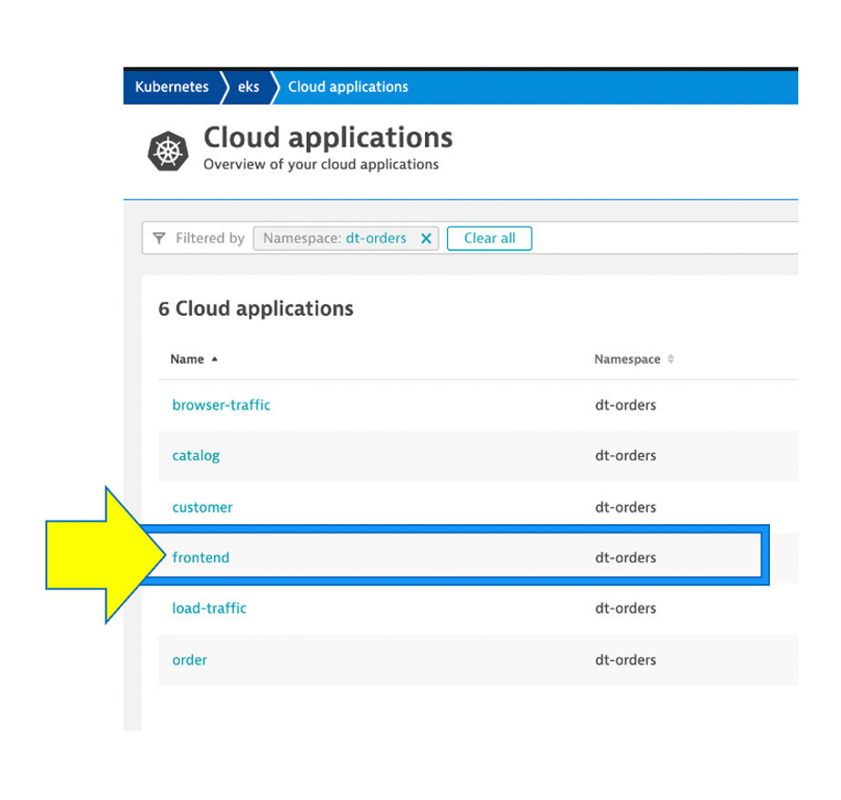
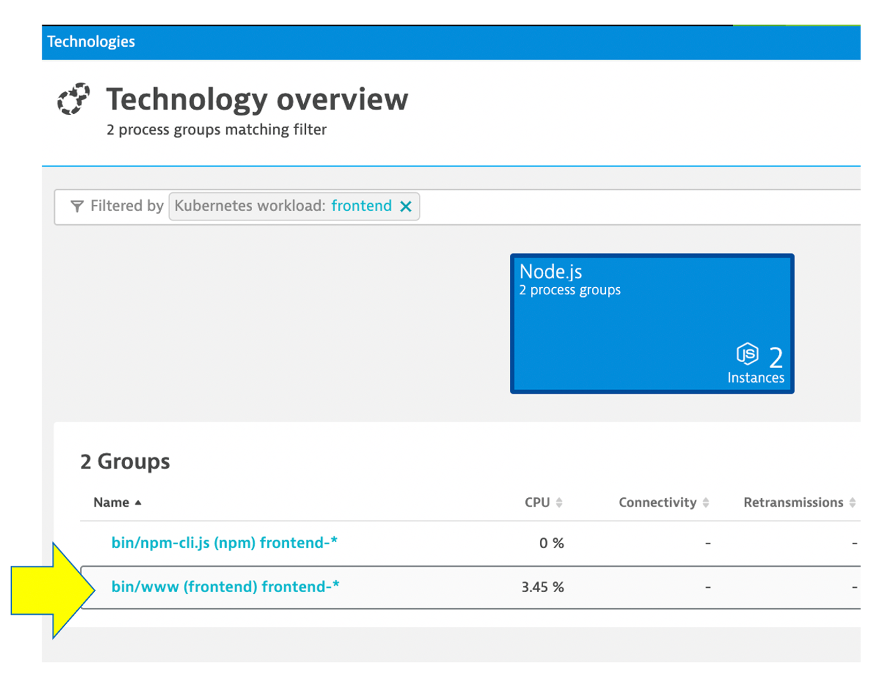
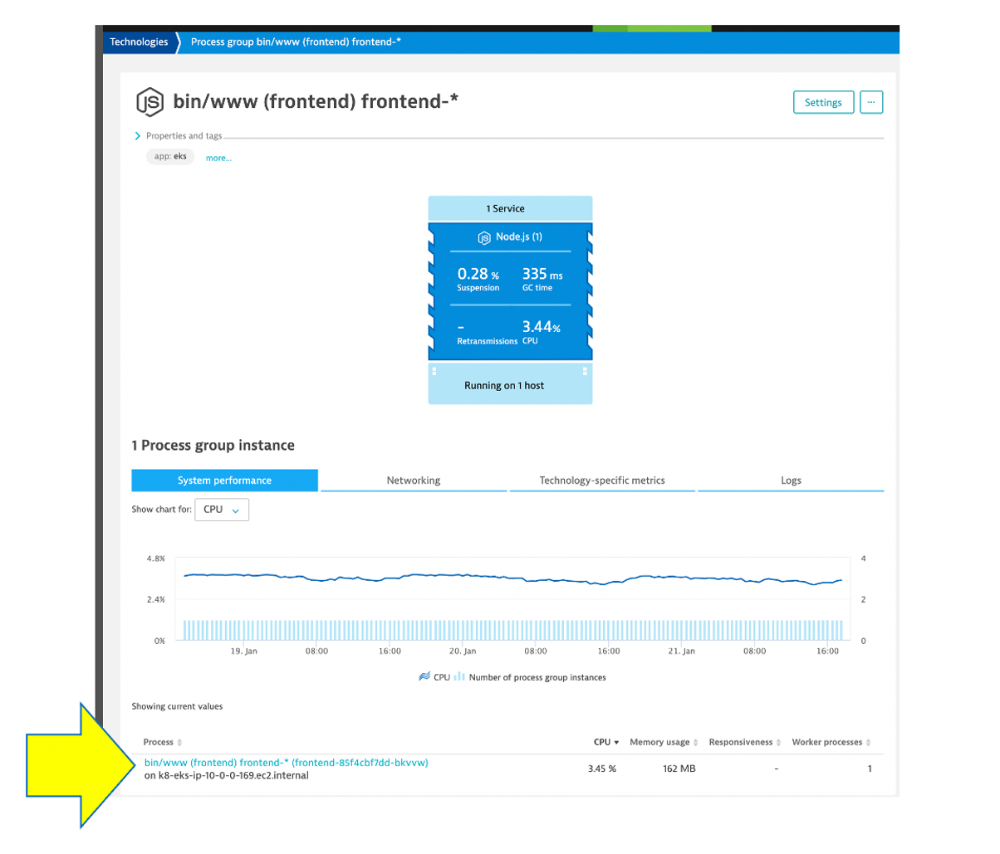
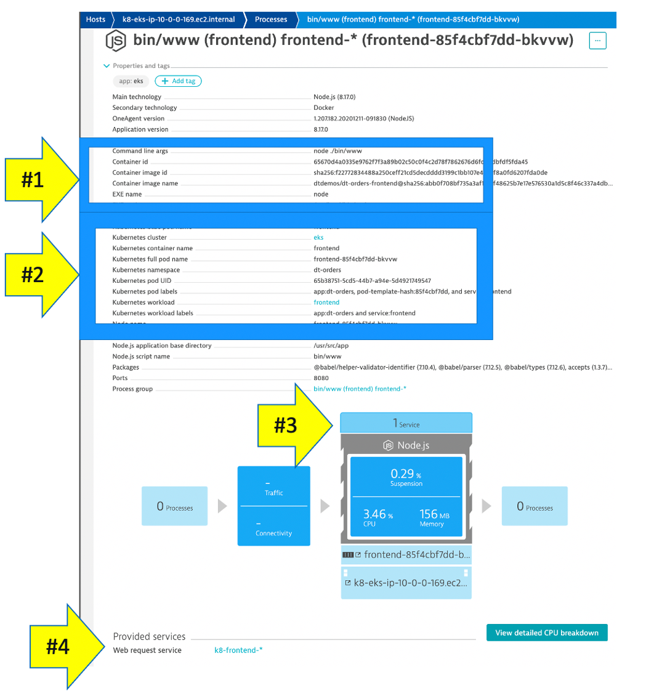
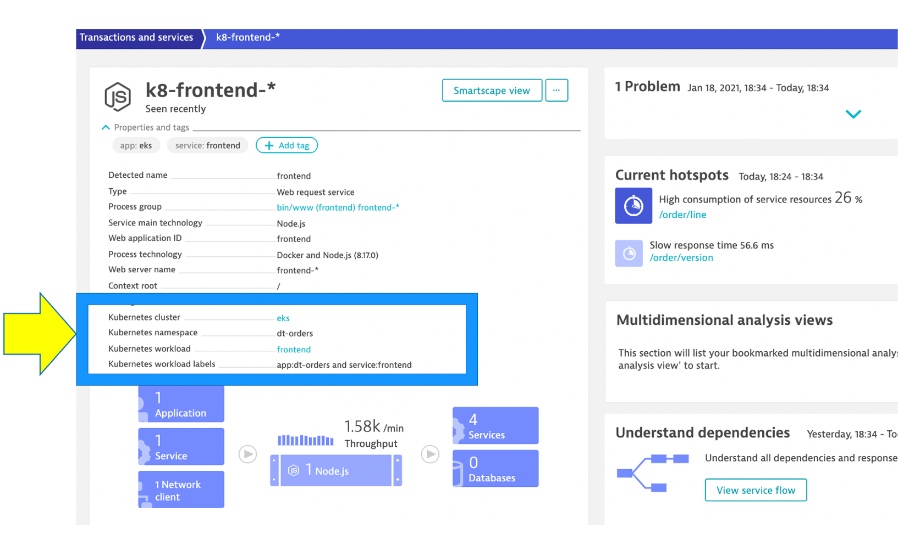

# Review Dynatrace

In this next few sections, review what the OneAgent automatically discovered for the host, services, processes, and the complete dependency mapping for the sample application running on Kubernetes.  

## 👍 How this helps

As you validate your modernization decisions, each of these views will give insights in accessing the profile, consumption and dependencies to other systems and services.

## Review kubernetes

💥 **TECHNICAL NOTE**: Dynatrace represents the layers of kubernetes following the `full stack` model as shown below.  Refer to this picture as we start from the bottom on the layering (cluster) and navigate through the layers up to the top (services) layer.

## Layer 2 - Cluster (Yes starting with Layer 2)

From the left-side menu in Dynatrace choose **kubernetes**

This dashboard summarized the cluster and workloads

## Layer 1 - Nodes (below Layer 2 🙂)

The resources for the Cluster are summarized for the one to many hosts or Cluster nodes in this view.

Explore specific node in the `Node Analysis` section, pick the `analyze nodes` button.

## Layer 3 - Namespaces

1. This workload section shows workload over time

1. In the `Cluster workload` section, pick the `view all workloads` button.

In the filter, pick `namespace` then `dt-orders`

## Layer 4 - Kubernetes workload

Pick the `frontend` to drill into.

## Layer 5 - Process group

Dynatrace automatically groups 'like' processes into process groups. Notice how the workload metrics are being aggregated.

Pick the `bin/www (frontend) frontend-*` process group to open the process group for the frontend.

Pick the `bin/www (frontend) frontend-*` process instance to open the process instance summary.

Pick the `frontend` application to drill into this workload to open the specific process.

## Layer 6 - Process

Referring to the diagram above, expand the `properties and tags` section to view:

1 . container information

2 . kubernetes information

3 . in the info graphic, pick the service to open the services list

4 . in the service list, click on `k8-frontend` service

## Layer 7 - service

This view should now look familiar.  In lab 1, we looked at the service for the `fronend` and `backend`

Do notice how the kubernetes information is also available in the service properties.

