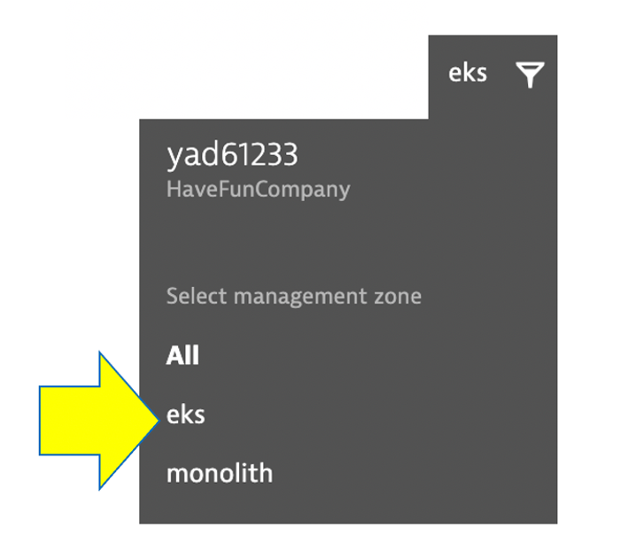
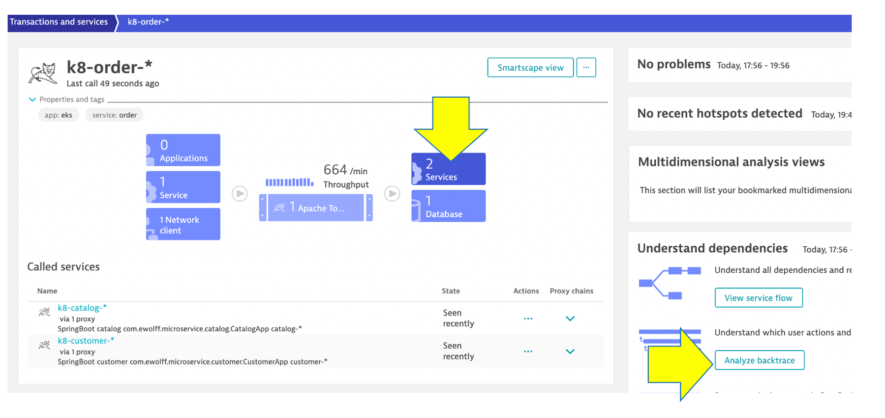

## Analyze Service Backtrace

Let’s now take a look at the transactions and Services by clicking on the `Transactions and services` left side Dynatrace menu.

## Open Service Page 

First filter by `eks` management zone.

Pick the `k8-order` service.

On this service, we also have was to quickly review the inbound and outbound dependencies.

Referring to the picture, within the services infographic, click on the "services" square to get a list of the services that the order service calls. 

## Open Backtrace Page

To see the backtrace page, just click on the `Analyze Backtrace` button.

You should be on the service backtrace page where you will see information for this specific service.

This will get more interesting in the next lab, but for the monolith backend, we can see that the backtrace is as follows:

1 . The starting point is the **scripts_backend-service_1**

2 . **scripts_backend-service_1** is called by the **scripts_front-end_1**

3 . **scripts_front-end_1** is a where end user requests start and the user sessions get captured within the **My web application** by default

## 👍 How this helps

The `service flow` and `service backtrace` give you a complete picture of interdependency to the rest of the environment architecture at host, processes, services, application perspectives. 