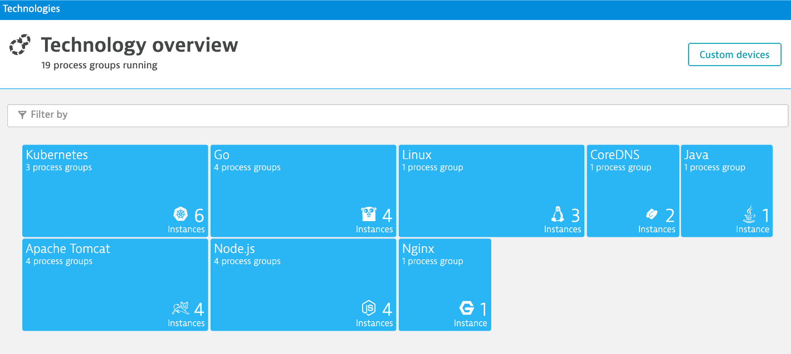

summary: Cloud Migration
id: 03-mobilize
categories: dynatrace
tags: migration
status: Submitted
authors: Rob Jahn
Feedback Link: https://github.com/keptn/tutorials/tree/master/site/tutorials

# Cloud Migration Best Practices / Bridging the gap between legacy & cloud

# Migration Assessment, Readiness and planning

Meet Florian, one the architects assigned to choose the right strategies, such as rehosting or rearchitect, for migrating the easyTravel customer application to AWS. Florian knows there are different risks, costs, and benefits of these [common adoption strategies](https://aws.amazon.com/prescriptive-guidance).

But one big challenge Florian faces is that the previous architect is no longer with the company so all the details of what is where and what is dependent on what within the technical stack is missing or poorly documented. All that exists is a diagram and notes on a wiki page he found that was last updated in 2013.

**Not having enough details about the current environment is hindering easyTravels ability to make the right decisions when planning what to migrate and when.**

To address this problem, you and Florian are going to install Dynatrace’s OneAgent to automatically discover the easyTravel application, services, processes, and build a complete dependency mapping for the entire application environment. So, let’s begin!

### Objectives of this section

* Review the Dynatrace OneAgent setup
* Review real-time data now available for the EZ-travel application
* Review how Dynatrace helps with Pre-Migration Planning

## Dynatrace OneAgent

[Dynatrace's OneAgent](https://www.dynatrace.com/support/help/setup-and-configuration/dynatrace-oneagent/) provides:

* A set of specialized processes that run on each monitored host. OneAgent collects metrics from the operating system it runs on and compares the metrics to performance metrics. The metrics are then reported to Dynatrace.
* Monitors technologies like Java, Node.js, .NET and more in greater detail by injecting itself into processes and monitors performance with code level insights.
* Delivers Real User Monitoring by injecting a JavaScript tag into the HTML of each application page that is rendered by your web servers.

The OneAgent can be automatically installed and rolled out through configuration management tools such as Chef, Puppet, Ansible, Terraform or by just including the download and install into any custom deployment script.

Check out this blog for another option to [Simplify OneAgent installation with AWS CloudFormation Registry](https://www.dynatrace.com/news/blog/simplify-oneagent-installation-with-aws-cloudformation-registry/)

You can review the process to manually install and try it one of your hosts with [this guide](http://AWS-modernize-workshop.alliances.dynatracelabs.com/120_more.html).

### Review EC2 instances

Let’s first review the EC2 instances where the easyTravel application is running by opening the [AWS portal ec2 instances page](https://console.aws.amazon.com/ec2/v2/home). 

Here there are two instances that both run the easyTravel application. The one named: **YOUR_LAST_NAME-workshop-ez** is deployed as a bunch of standalone processes.  The other one named: **YOUR_LAST_NAME-workshop-ez-docker** deploys the application as multiple Docker containers using Docker Compose.

2 . Click on the VM called **YOUR_LASTNAME-dynatrace-modernize-workshop-ez**

This will open a detail page where you can you find info about your instance.  Referring to the picture below, check out the following for your instance:

1. the Public IP to get to the EZ travel application
1. the security group that was added to expose the ports
1. AMI running Linux (ubuntu 18.04) host
1. [Instance Type](https://aws.amazon.com/ec2/instance-types/)

      

### Dynatrace OneAgent

These two EC2 Instances were created using a [CloudFormation Script](https://github.com/dt-demos/modernize-workshop-setup/blob/master/aws/workshopCloudFormationTemplate.yaml) and the [user data](https://docs.aws.amazon.com/AWSEC2/latest/UserGuide/user-data.html) boot scripts where used to installing easyTravel and the Dynatrace OneAgent.

If you were wondering **HOW** we already installed the Dynatrace OneAgent, just right click on the host named **YOUR_LAST_NAME-workshop-ez** and pick the **Instance settings** menu and then **View/Change user data**

These two command will download and run the OneAgent installer.  The URL and token you entered earlier were passed as parameters to the CloudFormation template.

Learn more about the various ways the OneAgent can be installed, check out the [Dynatrace documentation](https://www.dynatrace.com/support/help/setup-and-configuration/dynatrace-oneagent/)

### Open the easyTravel application

1 . Back on the ec2 instance page for **YOUR_LAST_NAME-workshop-ez**, use the copy button to copy the **public IP**.

2 . Then in a new Browser tab, paste that IP, **http://PUBLIC-IP**, to view the EasyTravel application. You should see a webpage that looks like this:

The application may take several minutes to start, so don't panic if it does not immediately appear.  Just keep the browser tab open and occasionally hit refresh.

3 . Back on the ec2 instance page, copy the **public IP** Dockerized version named  **YOUR_LAST_NAME-workshop-ez-docker**.  

4 . Then in an additional browser tab, paste that IP, **http://PUBLIC-IP**, to view the EasyTravel application.  Again, it may take few minutes to be available.

### Continue with the review

While the application is starting, let us now move to the next section to review what we can see now in Dynatrace.

## Host view

In this next few sections, review what the OneAgent automatically discovered for the host, services, processes, and the complete dependency mapping for the easyTravel application.  

As you plan your migration, each of these views will give insights in accessing the profile, consumption and dependencies to other systems and services.

From the left-side menu in Dynatrace choose **hosts** then click on the host with the prefix of **YOUR_LAST_NAME-workshop-ez**.

On host page, you will see basic infrastructure information for the host.

1. Now expand the **Properties** section to see data about the host:
1. Host resource metrics (CPU, memory)
1. Host availability
1. Discovered processes. In this case most of which are Java applications running in Tomcat.

### Smartscape view

Let’s see how Dynatrace can visualize these processes using Smartscape.

1. Just click on the `...` box on the to the right of the host name
1. pick **Smartscape view** menu option
1. this will open Smartscape filtered to this EC2 Instance

Feel free to explore the Smartscape.

### About Smartscape

Smartscape is Dynatrace's near real-time environment-topology visualization tool, is one of the most powerful features of Dynatrace. Smartscape auto-discovery delivers a quick and efficient visualization of all the topological dependencies in your infrastructure, processes, and services:

* On the horizontal axis, it visualizes all ingoing and outgoing call relationships within each tier
* On the vertical axis, it displays full-stack dependencies across all tiers
    * Datacenter
    * Hosts
    * Process
    * Service
    * Application

Enterprise have many hosts, services, and application that are ever changing. The ability to automatically discover and change as the environment changes is a key feature that Smartscape delivers.  Below is a picture taken from a more complex environment.

### How this helps

Smartscape shows all the dependencies of a given service. Those include connections to queues, web servers, app servers, and a native process. The host view shows historical and live time-series data for usage as well as the consuming processes. This information allows us to better plan the migration, as all depending services must be considered during the migration.

## Process

In the Smartscape view, we saw the visualizations of the relationships in vertical stack and as well as the relationships spatially. Now Let’s view the process and service running on the host.

As you plan your migration, you need more than just host level metrics.  Knowing the details for each services, **BEFORE** you change it, will lower the risk of impacting the business.

### Host view

Return back to the host view for the host with the prefix of **YOUR_LAST_NAME-workshop-ez** and locate the **Processes and Containers** section.

Click on the **com.dynatrace.easytravel.business.backend.jar easytravel-*-x*** process in the **Processes and Containers** section to open the process detail view.

### Process view

You should be on the process page where you will see information for this backend process.  Follow the picture below to locate the following:

1. Click on the **Properties** line to toggle on/off to see additional data about the process such as JVM version and open ports
1. Click to view the processes that call this process (Inbound)
1. Click to view the services that are served by this process. In this case there are multiple
1. Click to view the processes that this process calls (Outbound)
1. Click to view the Process specific time-services metrics

Note that Dynatrace automatically recognizes many common processes like Tomcat and will capture process specific metrics such as JVM garbage collection. See a list of supported technologies in the [Dynatrace documentation](https://www.dynatrace.com/support/help/technology-support/supported-technologies-and-versions/)

### View a Service

Now Let’s review a specific service.

1. Click the **services** square above the host infographic to open the list of services
1. From the list of services, choose the **BookingService**

### Service View

You should be on the service page where you will see information for this specific service.  Follow the picture below to locate the following:

1. Click on the **Properties** line to toggle on/off to see additional data
1. Click to view the services that call this service (Inbound)
1. Click to view the services that this service calls (Outbound)

### How this helps

Very quickly we have seen what processes and services are running on a host AND more importantly, what processes and services call (inbound) and are being called (inbound).  Having a real-time picture is certainly more accurate that out of date documentation.

## Service Flow

We just saw one way to review process and service communication, but Let’s look at how Dynatrace understands your applications’ transactions from end to end. and visualizes through **Service Backtraces** and **Service flows**.

* With **Service backtrace**, you see the calls **TO** a service.,

* With **Service flow**, you see the flow of service calls **FROM** a service, request, or their filtered subset. Along with the specific services that are triggered, you can also see how each component of a request contributes to the overall response time.

As you plan your migration, it is important to gain a complete picture of interdependency to the rest of the environment architecture at host, processes, services, application perspectives. Since time is always scarce, being able to do this in a single place can shorten assessment timelines.

### Service backtrace

From the same **BookingService** service, click on the **Analyze Backtrace** button.

You should be on the service backtrace page where you will see information for this specific service.

Dynatrace understands your applications transactions from end to end. This transactional insight is visualized several ways like the backtrace. The backtrace tree view represents the sequence of services that led to this service call, beginning with the page load or user action in the browser.

Follow the picture above to locate the services that were called in what order that called the **BookingService**

1 . The starting point is the **BookingService**

2 . **BookingService** is called by the **Customer Frontend**

3 . **Customer Frontend** is a Tomcat Server where end user request started

### Service Flow

Now Let’s see another visualization called the service flow. TO navigate to this view, refer to these steps and the picture below:

1 . Click the `...` in the row for the **Customer Frontend**

2 . Choose the **Service Flow** menu item

### Response time perspective

You should now be on the **Service flow** page.

Refer to the numbers in the picture above:

1 . The timeframe defaults to 10 minutes but can be adjusted

2 . We are viewing the data from a **Response time perspective**. Shortly, we will review the **Throughput perspective**.

3 . Click on the boxes to expand the response time metrics. We can see that 99% of the BookingService response time is spent in the CreditCardValidation service.

4 . Just 4% of the BookingService response time is spent in the easyTravelBusiness database from the calls from CreditCardValidation.

5 . The BookingService service also calls the easyTravelBusiness database, but just 1% of the BookingService response time is spent in the easyTravelBusiness database.

### Throughput perspective

Refer to the numbers in the picture above:

1 . The timeframe defaults to 10 minutes but can be adjusted

2 . Change to the **Throughput** perspective by clicking on the box

3 . Click on the boxes to expand the metrics to see the number of requests and average response times going to the BookingService

4 . We can see that on 50% of the calls to `BookingService` go to the `easyTravelBusiness` database. But, it does this 4x per request.

5 . Every call to BookingService make a call to the `CreditCardValidation` service

### View SQL details

Within easyTravel, the easyTravelBusiness database is actually an [Apache Derby embedded relational database](https://en.wikipedia.org/wiki/Apache_Derby). And the OneAgent Let’s is automatically see all the SQL statement details. To see them, refer to these steps in the picture below:

1 . Click on the easyTravelBusiness database

2 . Expand the `easyTravelBusiness` tile

3 . Click on `View database statements`

### How this helps

From both these perspectives and this example, we now know that the bulk of the time is spent in the CreditCardValidation service, BUT more importantly and we also learned that both the BookingService and the CreditCardValidation service communicate to this database. **An important detail for planning!!**

The service flow and the database statements will also help you right size your database instance in the new environment and scale depending on the resource consumption during regular business and off business hours.

## Transactions

Within Dynatrace, services can take the form of web services, web containers, database requests, custom services, and more. Services may in turn call other services such as web services, remote services, and databases services.

Web applications consist of web pages that are served by web servers and web containers, for example Tomcat. Web and mobile applications are built upon services that process requests like web requests, web service calls, and messaging. Such "server-side services" can take the form of web services, web containers, database requests, custom services, and more. Services may in turn call other services such as web services, remote services, and databases services.

As you plan your migration, it is important to gain a complete picture of interdependency to the rest of the environment architecture at host, processes, services, application perspectives. Since time is always scarce, being able to do this in a single place can shorten assessment timelines.

### View the complete end to end flow 

Let’s now take a look at the transactions and Services by click on the `Transactions and services` left side Dynatrace menu.

There a lot of services in this list. To help manage this list a [Dynatrace auto-tagging rule](https://www.dynatrace.com/support/help/how-to-use-dynatrace/tags-and-metadata/) was added by the workshop scripts and we can now use a tag filter to make this list more manageable.

In the filter box, type tag, choose `workshop-group`, and the value of `ez-travel`. It should look like this:

You can now pick the `EasytravelService` service to open the service page. From the `Understand dependencies` section on the right, click the `view service flow` button to see what it calls. It should be more complex as shown below.

### How this helps

Knowing the type of access, executed statements, and amount of data transferred during regular hours of operation allows for better planning and prioritization of the move groups. In some cases, you may decide to not migrate this database in favor of other services or databases that are less complex to migrate due to fewer dependencies.

If you want to learn more about the approach and features available in Dynatrace to virtually break your monolithic architecture, have a look at [8-Step Recipe to Break Monoliths](https://www.dynatrace.com/news/blog/breaking-the-monolith-an-8-step-recipe/).

## Databases

As you plan your migration, Database observability is critical to a successful plan. Knowing the type of access, executed statements, and amount of data transferred during regular hours of operation allows for better migration planning and prioritization of the move groups. In some cases, you may decide to not migrate this database in favor of other services or databases that are less complex to migrate due to fewer dependencies.

To learn some out of the box features of Dynatrace, Let’s do a quick review the two databases that exist for easyTravel.

### Review MongoDB

Click on the **Mongo** database to open the database page. 

On this page you can explore the database process metrics like writes, reads, and drill into database statements.

### Review SQL Database

Click on the **Databases** link in the Dynatrace's left side menu to view the databases that OneAgent was able to automatically discover and instrument.

As mentioned early, easyTravel uses an [Apache Derby embedded relational database](https://en.wikipedia.org/wiki/Apache_Derby), but we also setup a easyTravel EC2 Instance that is running MongoDB in a docker container. So you should see both listed in the database view.

### How this helps

When monitoring database activity, Dynatrace shows you which database statements are executed most often and which statements take up the most time. You can also see which services execute the database statements what will be direct input to migration planning and prioritization of the move groups.

Dynatrace monitors all the popular database SQL Server, Oracle, MongoDB to name a few. See [Dynatrace documentation](https://www.dynatrace.com/platform/database-monitoring/) for more details on platform support.

## Technologies

By default, Dynatrace gives you FullStack horizontal (who talks to whom) and vertical (what runs on what) dependency visibility as part of Dynatrace Smartscape! All without a single line of code or configuration change – just by installing the OneAgent

Seeing which processes make up the monolith has been an eye-opener for many teams that have done this exercise. “Oh – we completely forgot about the dependency to this legacy process we introduced 5 years ago!” – that’s a common thing you hear!

As you plan your migration, knowing what technologies make up your eco-system is key so what you can decide whether to migrate, refactor or replace certain services.

### Technology View

Click on the **Technologies** link on the left side menu within Dynatrace to view the technologies that OneAgent was able to automatically discover and instrument.

The workshop is somewhat limited, so here is an example from another environment.

### How this helps

This is another out the box feature that helps you understand what technologies are in your environment and with a heatmap presentation to what degree they exist. 

## Summary

By just installing the OneAgent, we have now gained a detailed topological view of easyTravel from the both the infrastructure and application tiers and we are now ready to tackle our adoption to the cloud armed with the answers we need.

* **Right Priority** - We now understand the complexity and interdependency of services and components to the rest of the environment architecture
* **Right-Sizing the environment** - We now understanding which resources are required to move along with their required resource consumption patterns
* **Best Migration Strategy** - We now understand the current end-to-end transactions through architecture and can choose the best migration strategy (rehost, refactor, rearchitect, rebuild)

### Checklist

In this section, you should have completed the following:

* Add the Dynatrace OneAgent to EZ-travel application
* Review real-time data now available for the EZ-travel application
* Review how Dynatrace helps with Pre-Migration Planning