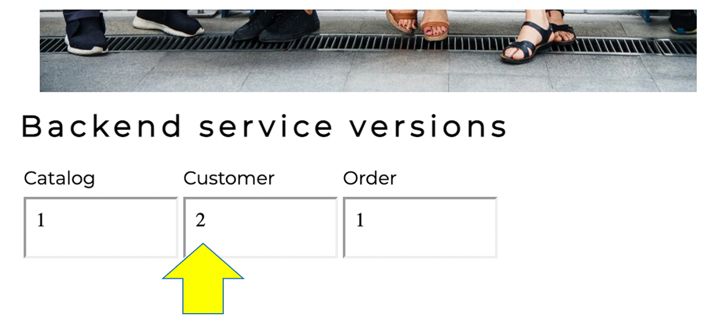
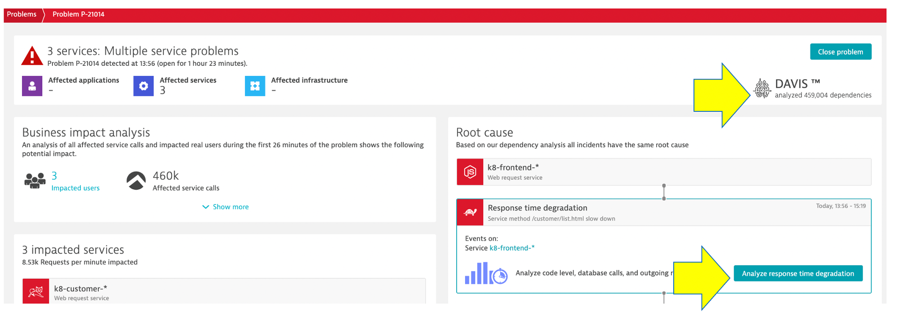
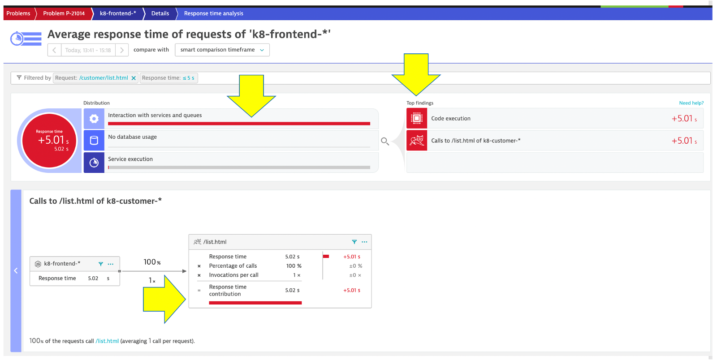
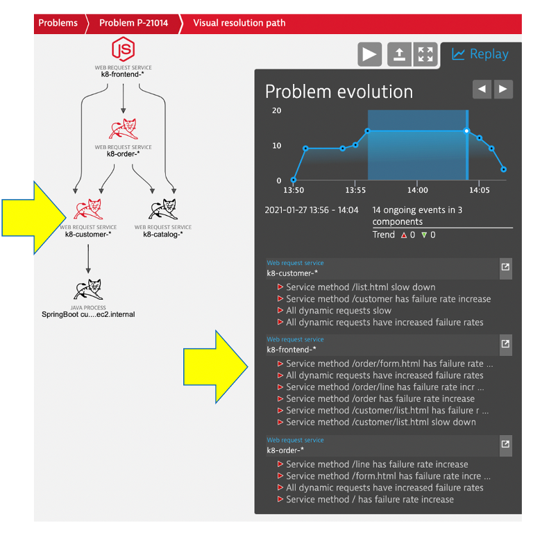

## Enable a problem

Various problem patterns that Dynatrace can detect are built into the sample application codebase so that we can easily simulate problems without redeploying the application.

We are first going to look at `customer-service` version 2 that causes:
* response time issue on `View Customer List (/customer/list.html request)`.

Refer to the [dt-orders overview README](https://github.com/dt-orders/overview#pre-built-docker-images) for more details.

## Enable the problem pattern

Back in the SSH terminal, we will simple run a `kubectl` command that will update the running deployment.

So, to change from `customer container image 1` to `customer container image 2`, just run this command.

```
kubectl -n dt-orders set image deployment/customer customer=dtdemos/dt-orders-customer-service:2
```

You should see `deployment.apps/customer image updated` as the output.

## View app in browser

If you need the URL again, run this command and copy the `EXTERNAL-IP` for the frontend

```
kubectl -n dt-orders get svc
```

The browser should now show version 2



## Review Kubernetes deployment

While we wait for the problem to show up, lets review the deployments.  Start with this command:

```
kubectl -n dt-orders get deploy -o=wide
```

To view the details of the `customer` deployment, run this command and notice you are running `Image: dtdemos/dt-orders-customer-service:2`

```
kubectl -n dt-orders describe deploy customer
```

Where did this come from?  We automated this, but this is the deployment file for customer if you want to look. [View customer-service.yaml](https://github.com/dt-orders/overview/blob/master/k8/customer-service.yaml)

## Review problem in Dynatrace

Within Dynatrace, choose the problems left side menu option.  I may take a minute or two but you will see a problem card.  On this card, notice:

* Impacted services
* Davis analysis
* Root cause



Click on the `Analyze response degradations` button to open the details page.  On this page notice how Dynatrace determined the source of the problem automatically.



Back on the problem page, click into the `visual resolution path` to see how the Davis analyzed events and behavior to determine the problem and impacted services.




