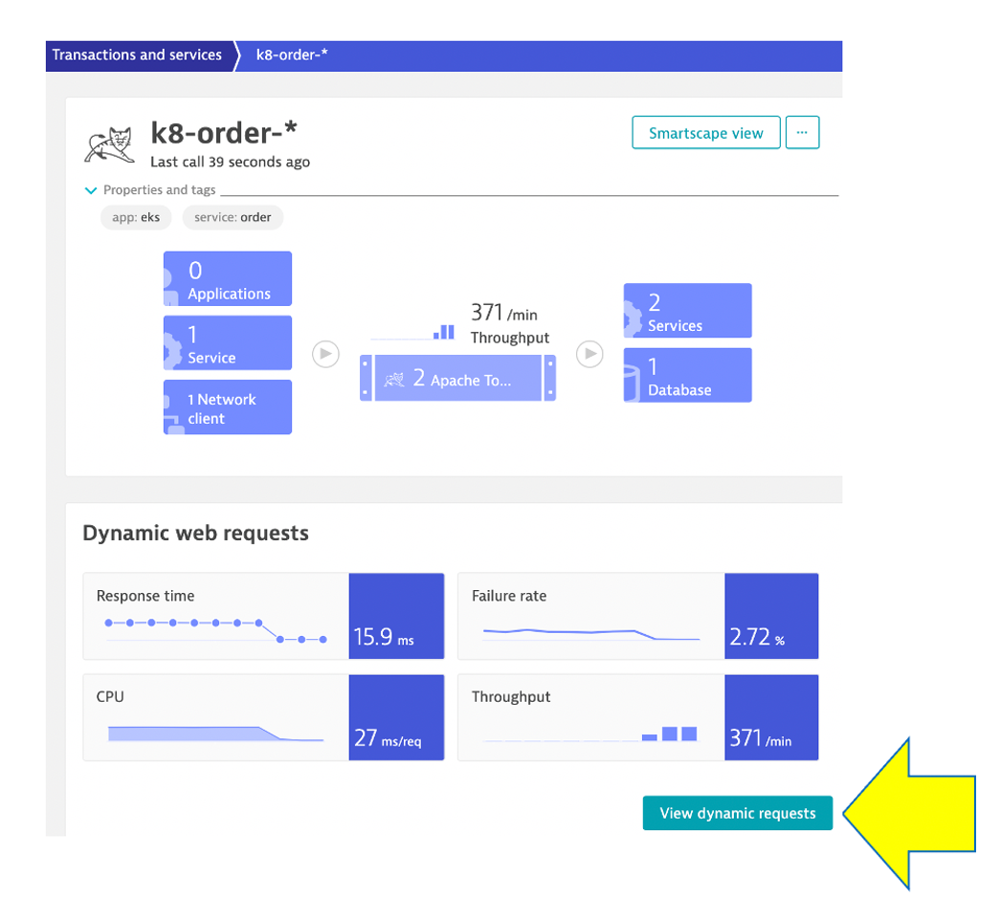
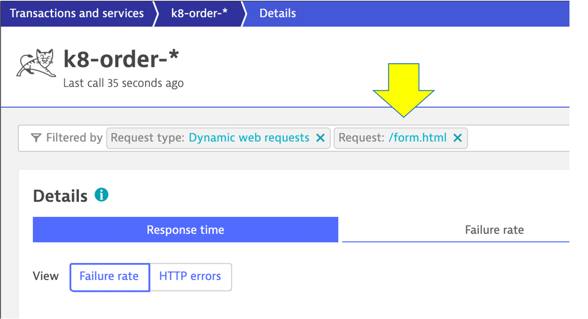
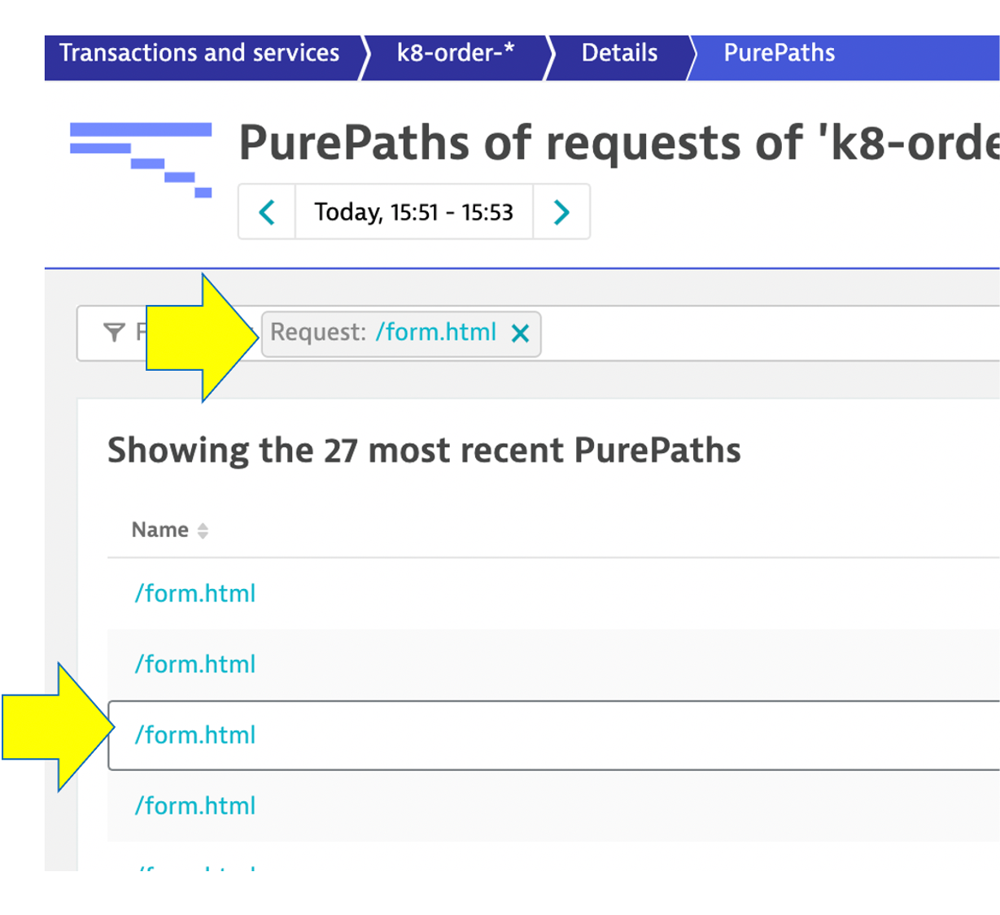
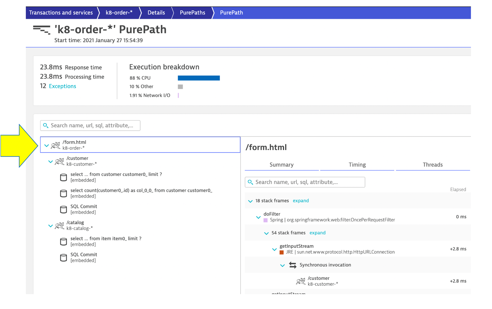
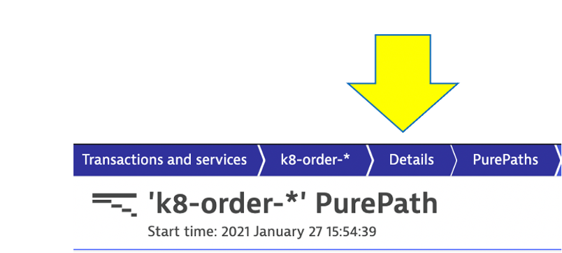
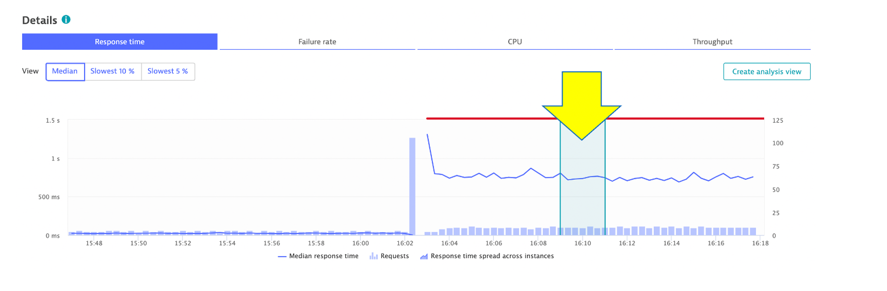
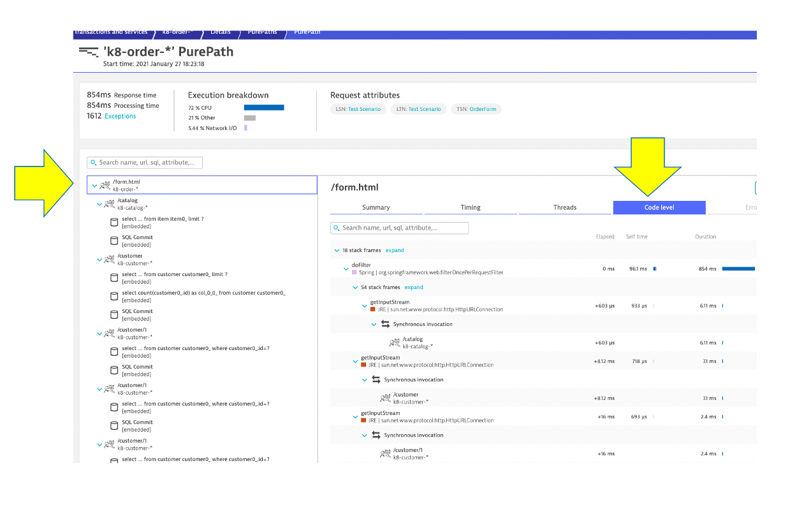

## Review PurePath

Recall that the `order-service` version 2 causes two problems, so lets review the second one:
* High number of database calls on the `Open Order page (/order/form request)` for the part when the customer drop down list box needs to be populated
* Refer to the [dt-orders overview README](https://github.com/dt-orders/overview#pre-built-docker-images) for more details.

We are now going to review the high number of database calls by comparing the two versions of the order service. 

## Review order service version 1

Go back to the `transactions and services` menu, click on the `k8-order` service.

On the `k8-order` service page, click the `view dynamic requests` button.

On the `dynamic requests` page, scroll to bottom and click on the `/form.html` request to filter on it.  After you click on it, the filter will look like this:

What you need to do now is filter the time-series graph to BEFORE the problem causes by version 2.

So, just click on the time-series graph when the response times were fast.

Under time-series graph, click the `view purepaths` button like to open the `purepath list` page.

Then click one of the rows for `/form.html` to open the `purepath detail` page.

Notice on this page how there are just a few SQL calls to get the data for this request.

## Review order service version 2

Go back the `k8-order` service page using the bread crumb menu called 'detail'

Now just click on the time-series graph when the response times were flow.

Under time-series graph, click the `view purepaths` button like to open the `purepath list` page.

Then click one of the rows for `/form.html` to open the `purepath detail` page.

Notice on this page how there now many SQL calls to get the data for this request.
