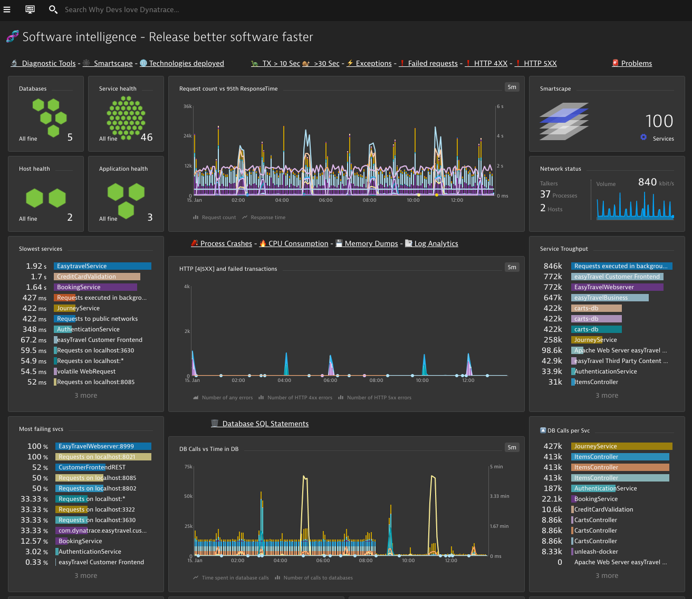

##  Overview of the System 
### Diagnosing the Health of an Environment

Leveraging tags and ManagedZones you can get very fast and easy an understanding of UX, transactions, hosts, application network traffic, failures on the whole environment or on specific stages, departments, subcompanies, etc.

