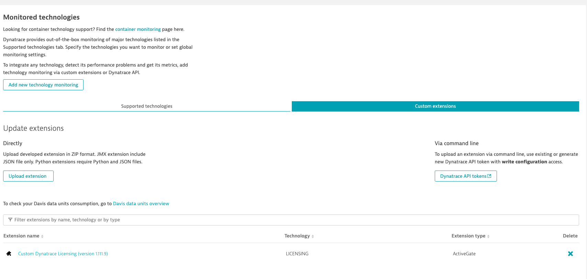

## Configure Licensing ActiveGate Extension
In this activity step, we’ll walk you through the configuration of the licensing ActiveGate extension. 

Navigate to **Settings** > **Monitoring** > **Monitored technologies** > **Custom extensions** tab

### Step 1: Open configuration details
1. Click **Custom Dynatrace Licensing (version 1.111.9)** extension to open configuration details.
1. Expand an endpoint configuration to edit values.

### Step 2: Configfure the extension
1. Provide a custom **endpoint name**. For example: `Dynatrace Managed cluster`.
1. Set **Managed URL** to your Dynatrace Managed cluster URL. For example: `https://abc123.dynatrace-managed.com`.
1. **Choose ActiveGate** from the list.
1. Set **MSP or Cluster Name** to a custom name. For example: `My Company`.
1. Set **Cluster Token** to the `Licensing-extension-token`.
1. Click **Update**.

Verify successful extension start. The Demo Plugin should display the Ok status. Wait patiently. It takes up to 2 minutes for the first data to be collected.

### Step 2: Look around
1. Navigate to Technologies and find LICENSING tile.
3. Analyze various chart types on device page