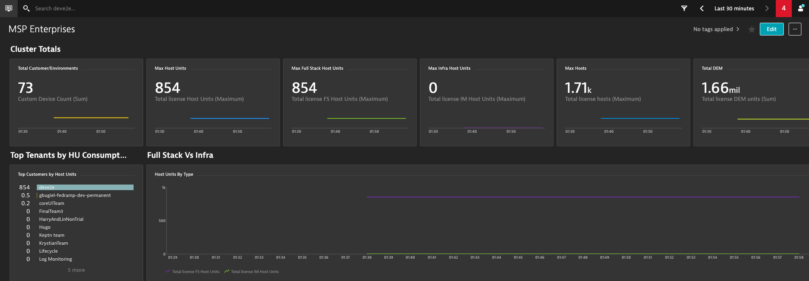

## Import Licensing Dashboard
In this activity step, we’ll walk you through importing a custom dasbhoard that presents our license consumption metrics. 

### Step 1: Download the dashboard
In the University classroom, go to "Materials" and download **dashboard** file. Store it on your local computer.

### Step 2: Import the dashboard

1. Navigate to **Dashboards** from the navigation menu
1. Click **Import dashboard** button and select the downloaded dasbhoard file
1. Click **Import with owner `'<username>'`** to confirm and overwrite dashboard's owner.

You should be redirected to the new dashboard! Here's how it looks like:

