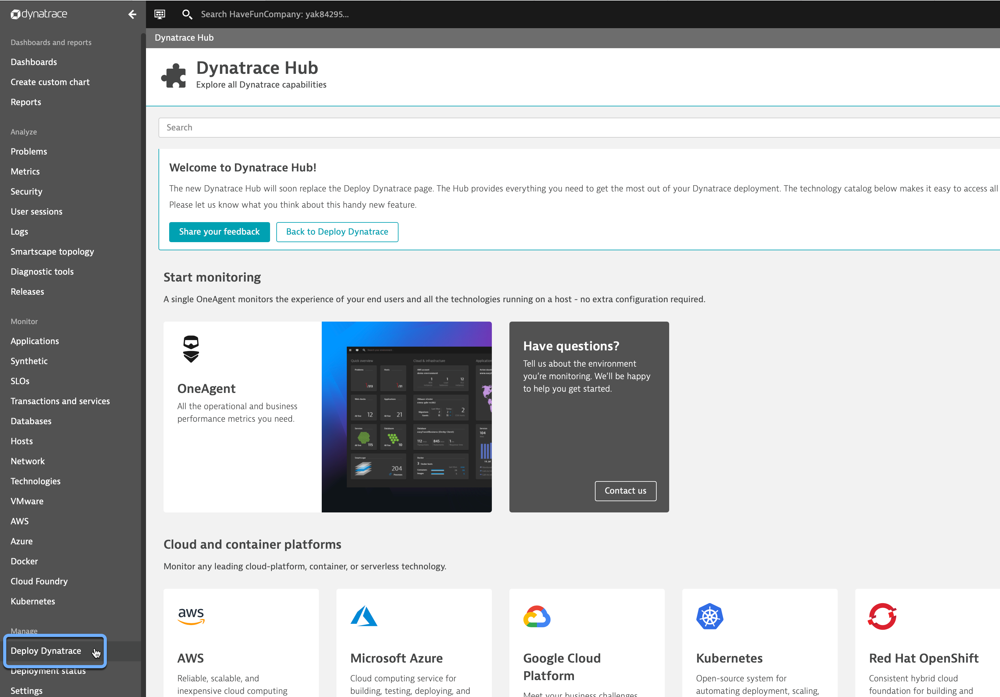
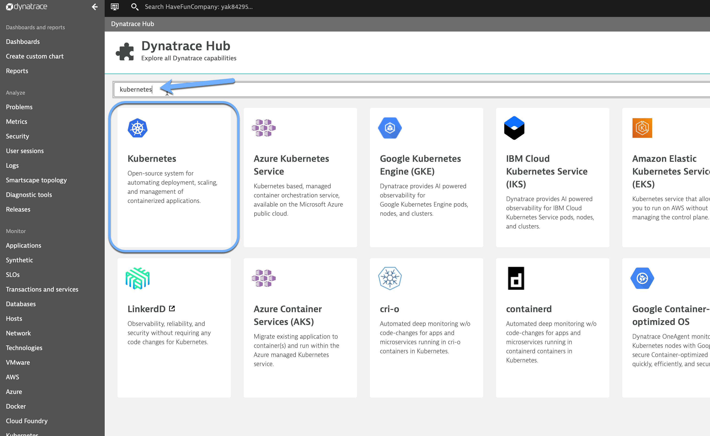
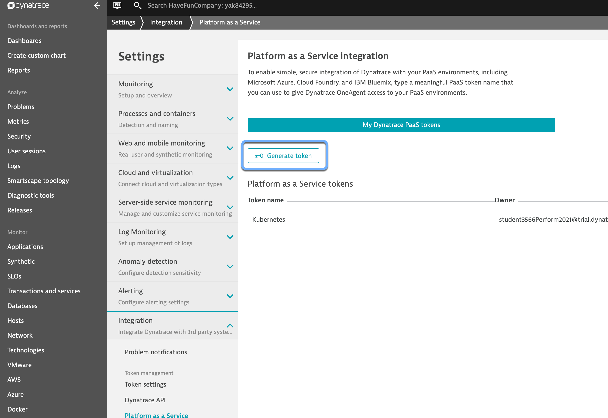
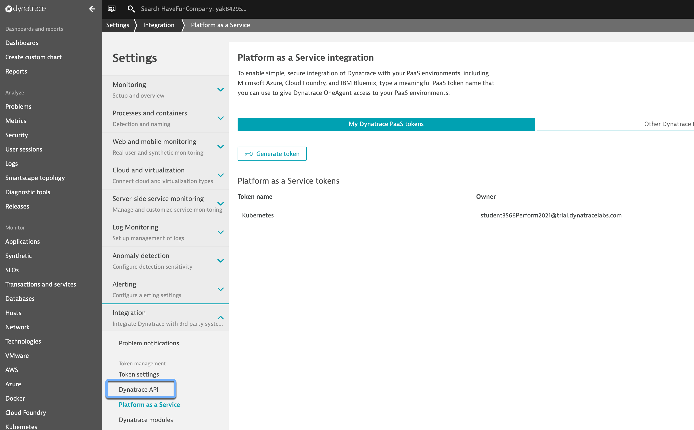
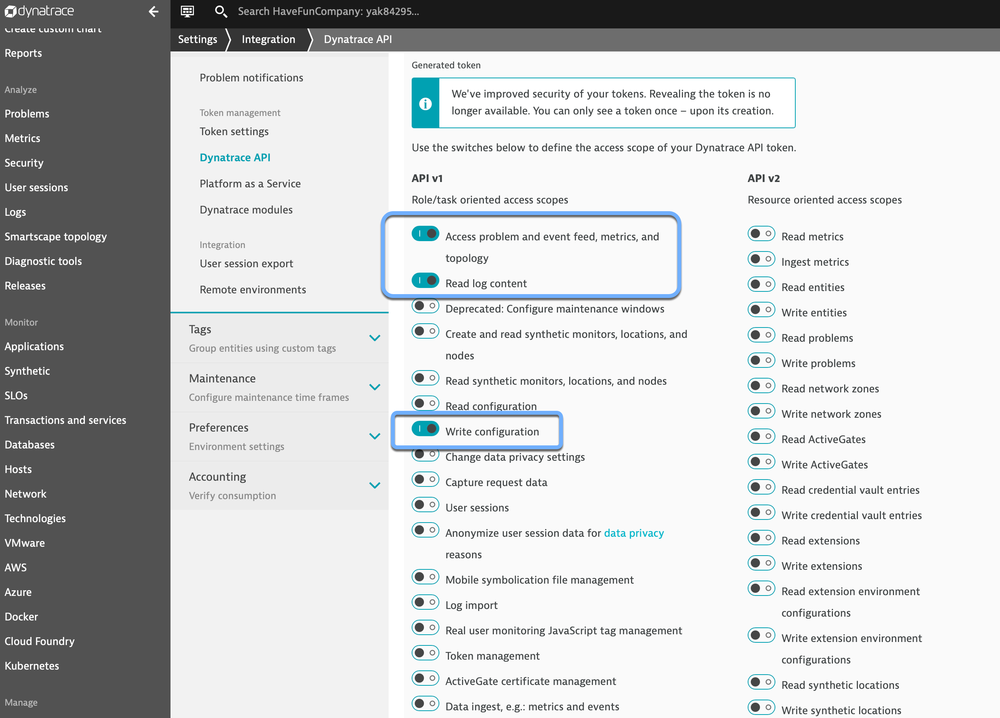
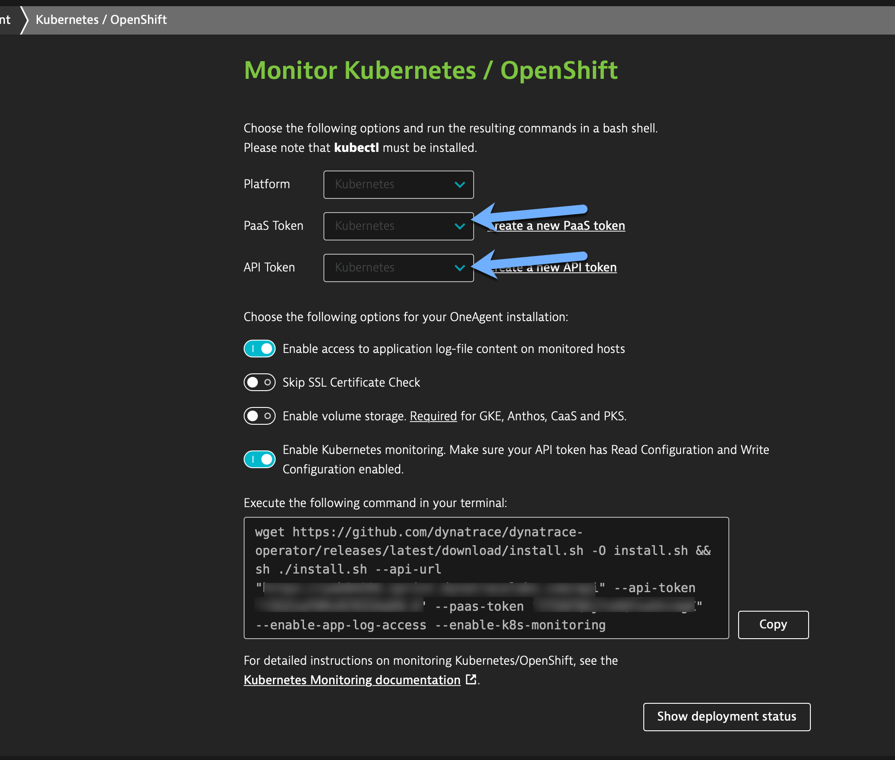
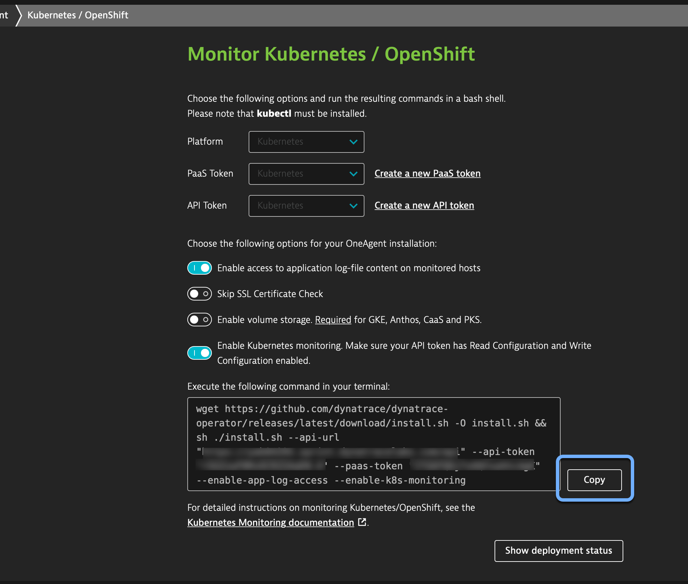
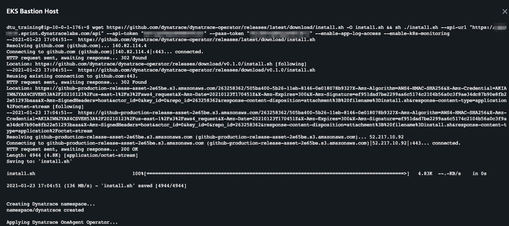
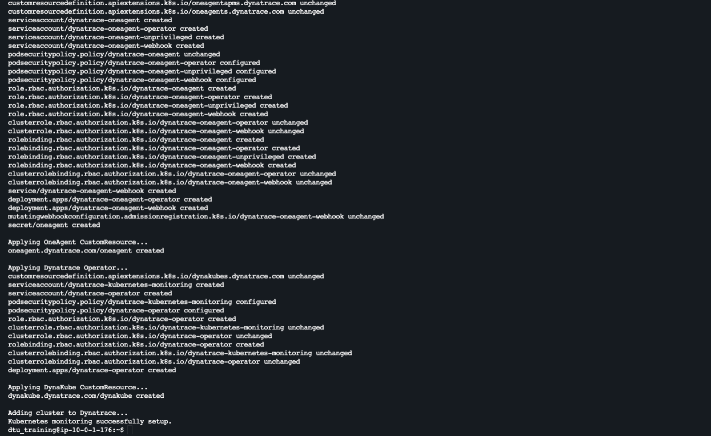

## Instrument Kubernetes with Dynatrace

This lab guide will deploy the Dynatrace Operator and Dynatrace integration for Kubernetes.

### 1. Deploy Dynatrace

1. Navigate to Dynatrace tenant and select "Deploy Dynatrace" from left-hand navigation bar

   

2. Search for "kubernetes", then select the kubernetes tile and then "Monitor Kubernetes"
   

3. In the Monitor Kubernetes Deployment screen -> Create a new PaaS Token

4. Click "Generate Token" -> give your token a name -> click "generate" BE SURE TO COPY YOUR PAAS TOKEN

   

5. In the left-hand setting menu, select "Dynatrace API"

   
   
6. Create an API Token with the below permissions

   
   
   - After creating the PaaS token follow the step 1-3 above to get back to the kubernest deployment screen.

6. Select the PaaS and API tokens you previously created

   

7. Click the Copy Button next to the auto-generated wget command

   

8. Run Script on Bastion host

   
   

### 2. Update Kubernetes Integration Settings
1. In Dynatrace Tenant, Click Settings -> Cloud and Virtualization -> Kubernetes

   

2. Click on the Edit icon for the configured K8S clustername

         

3. Set the toggle switches
   - Toggle off "Require valid certificates for communication with API server". This is because the workshop k8s cluster are using self signed certificates.

   - Toggle on "Monitor Prometheus exports"
   

4. Click Add event field selector
   

5. Add a field selector name and expression

   

   - Click Save.

6.  Toggle on Monitor events

   

7. Click Save.   
