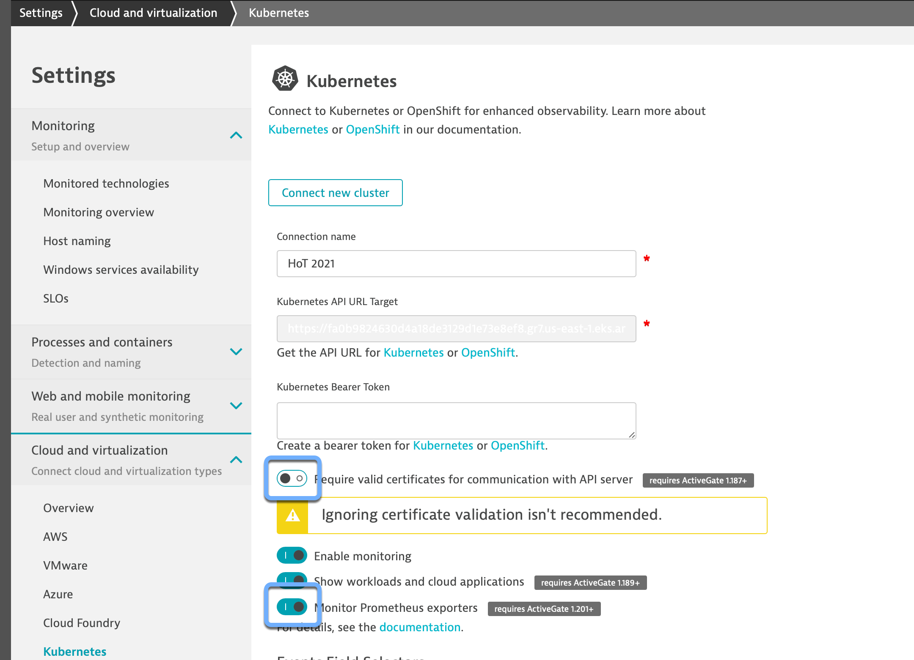

## Instrument Kubernetes with Dynatrace - Part 2

This lab guide will deploy Dynatrace integration for Kubernetes.

### Update Kubernetes Integration Settings

1. In Dynatrace Tenant, Click Settings -> Cloud and Virtualization -> edit icon for configured K8s cluster

       

3. Toggle the following switches:
   - Change the connection name to "HoT 2021".

   - Toggle OFF "Require valid certificates for communication with API server" (this workshop cluster uses self-signed).

   - Toggle ON "Monitor Prometheus exports"
   
   

4. Click Add event field selector

   

5. Provide a field selector (other events) name and expression (involvedObject.kind!=Node)

   

6. Toggle on Monitor events

   
   
   - Click Save. 

7. Verify Dynatrace Operator Deployment
   
   - Navigate to Kubernetes -> HoT 2021 
   - Scroll down to Name Spaces and select Dynatrace
   
   
