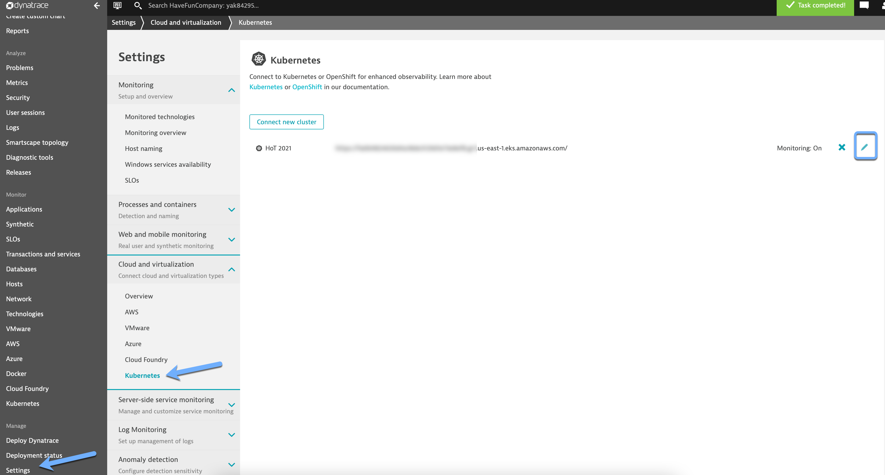
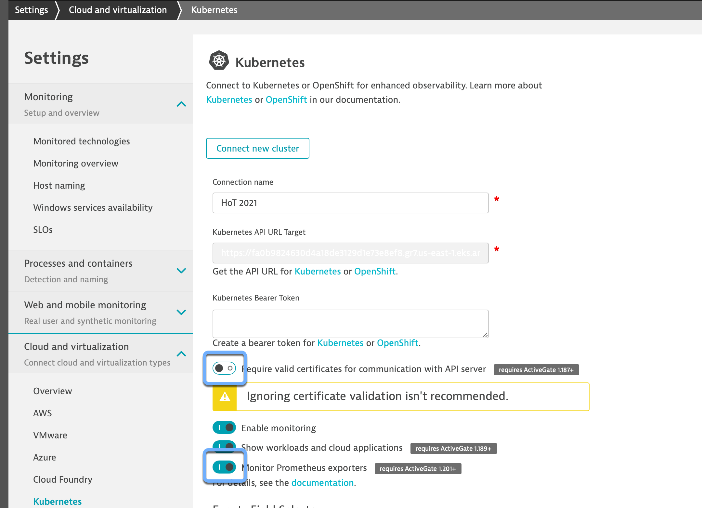

## Instrument Kubernetes with Dynatrace - Part 2

This lab guide will deploy Dynatrace integration for Kubernetes.

### Update Kubernetes Integration Settings

1. In Dynatrace Tenant, Click Settings -> Cloud and Virtualization -> edit icon for configured K8s cluster

       

3. Toggle the following switches:
   - Toggle OFF "Require valid certificates for communication with API server" (this workshop cluster uses self-signed).

   - Toggle ON "Monitor Prometheus exports"
   
   

4. Click Add event field selector

   

5. Add a field selector name and expression

   

   - Click Save.

6.  Toggle on Monitor events

   

7. Click Save.   
