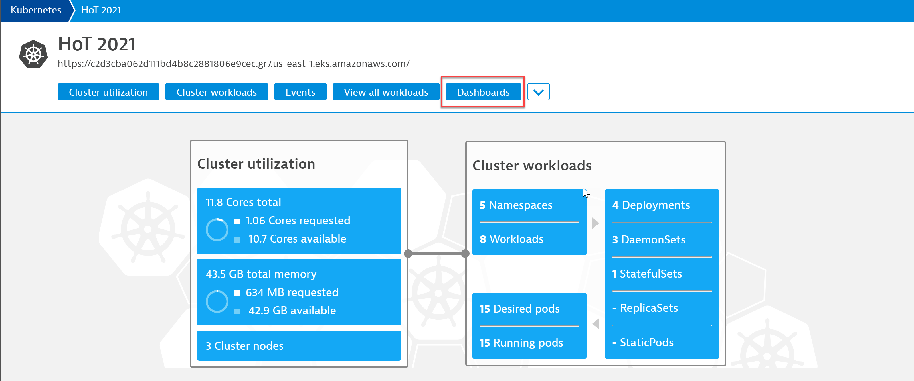
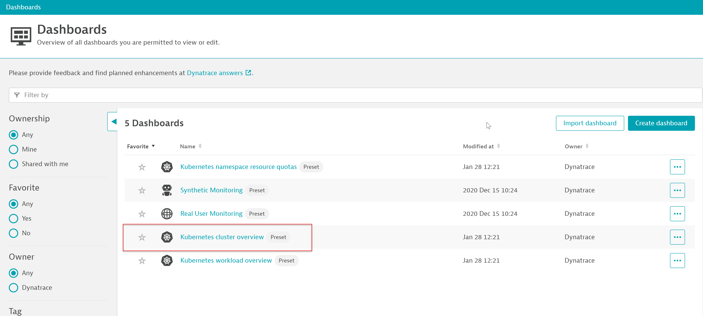
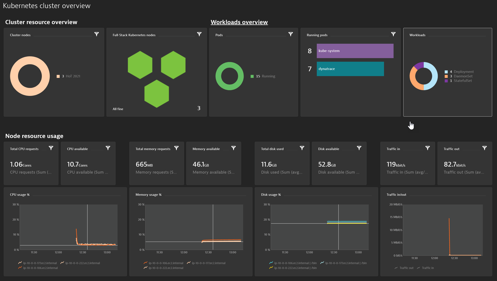
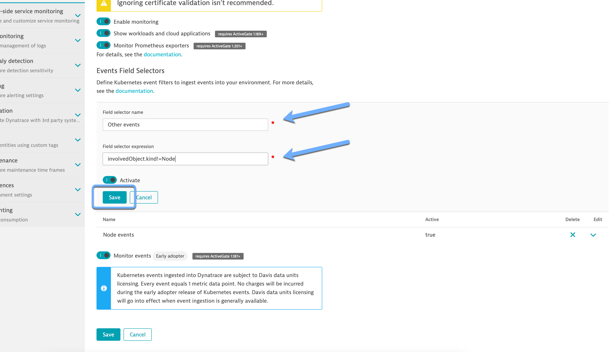
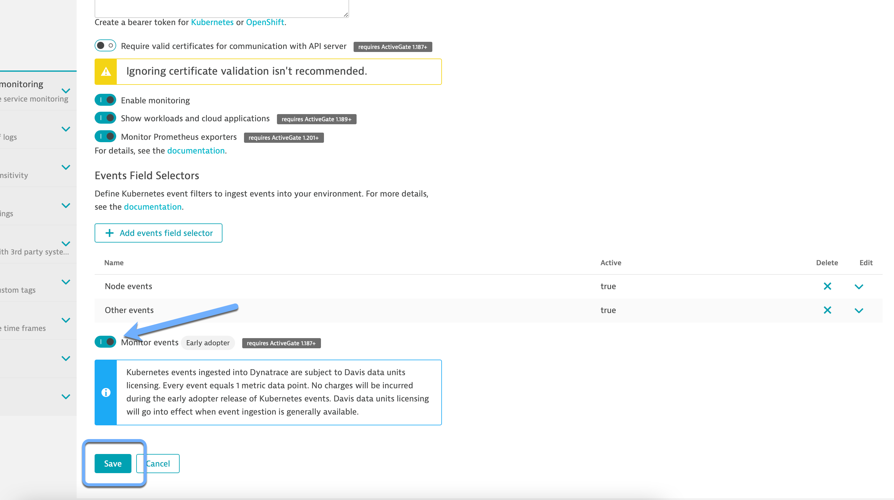
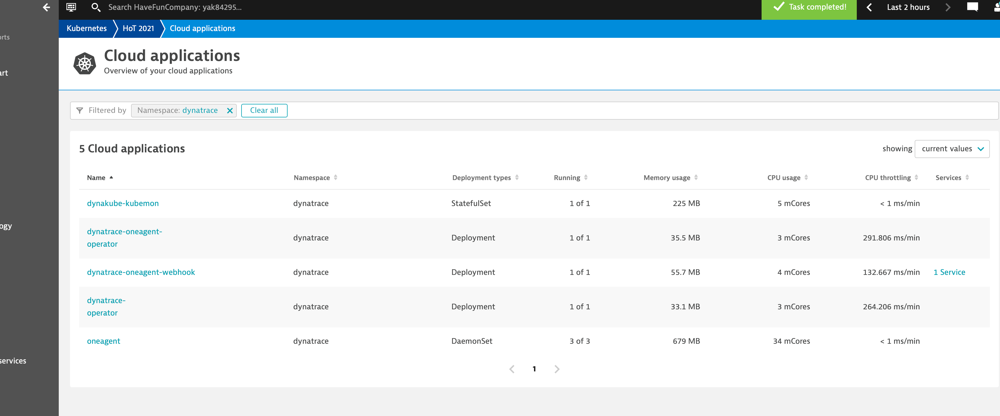

## Dynatrace Dashboards for K8s - Part 3

This lab guide will cover the standard dashboards that are part of K8s deployment.

### Navigating K8s Dashboards

1. In Dynatrace Tenant menu, Click Kubernetes, then click on Dashboards

       

2. The Kuberbetes deployment created the following preset dashboards.
   - Click on the Kubernetes Cluster Overview dashboard.
   
   

3. Explore the dashboard to see a performance overview of the cluster

   

5. Provide a field selector (other events) name and expression (involvedObject.kind!=Node)

   

6. Toggle on Monitor events

   
   
   - Click Save. 

7. Verify Dynatrace Operator Deployment
   
   - Navigate to Kubernetes -> HoT 2021 
   - Scroll down to Name Spaces and select Dynatrace
   
   

