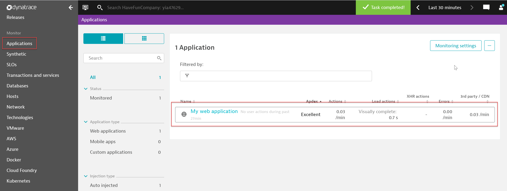
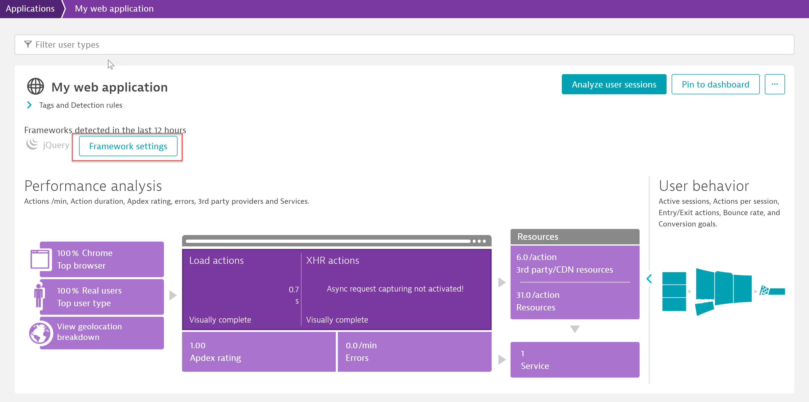
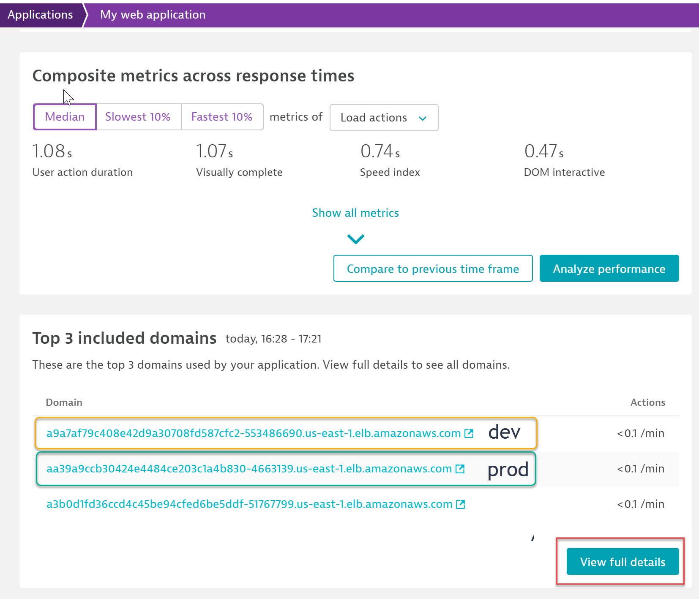

## Configure Dynatrace Application

This lab exercise will create a Dynatrace application for the Sock Shop application that was deployed. 

### Create Application
1.  Navigate to Applications and then select "My Web Application".
 
 
 
2.  This is the default application bucket that catches all URLs for servers and services that are instrumented with Dynatrace. Scroll towards the bottom to "Top x Include Domains"
 
  
  
3. Click on View Details
   - Both dev and prod Sock Shop domains are listed. They should match what you copied to notepad.
  
   
   
4. Expand the domain and click on "Create New Application"

   
   
   Click "Create"
   
   
   
   

