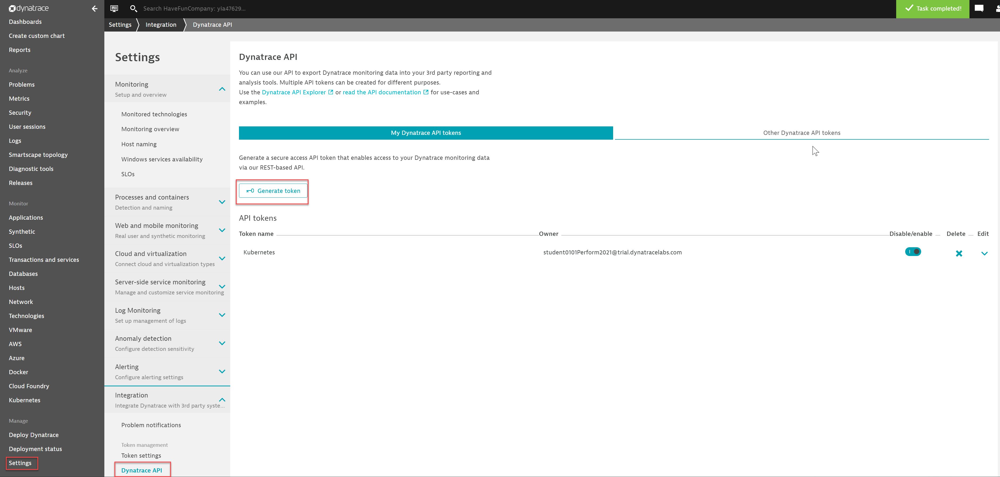
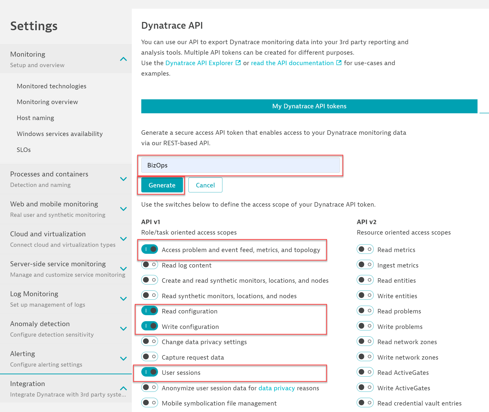
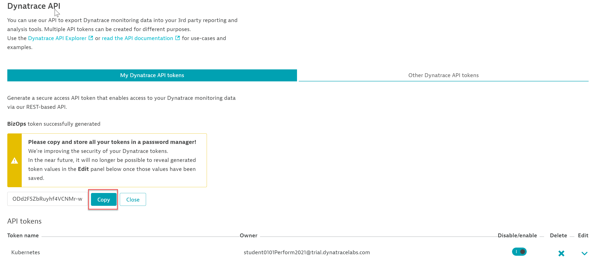
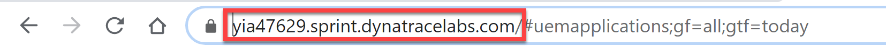
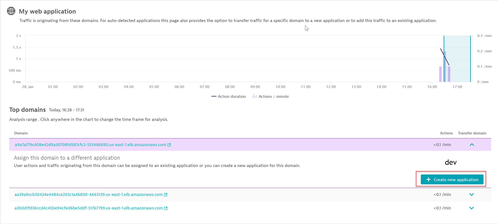
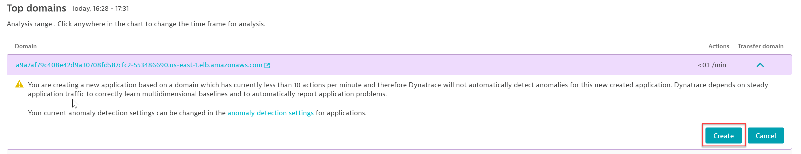
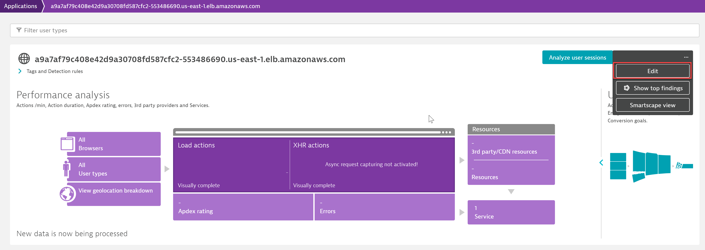
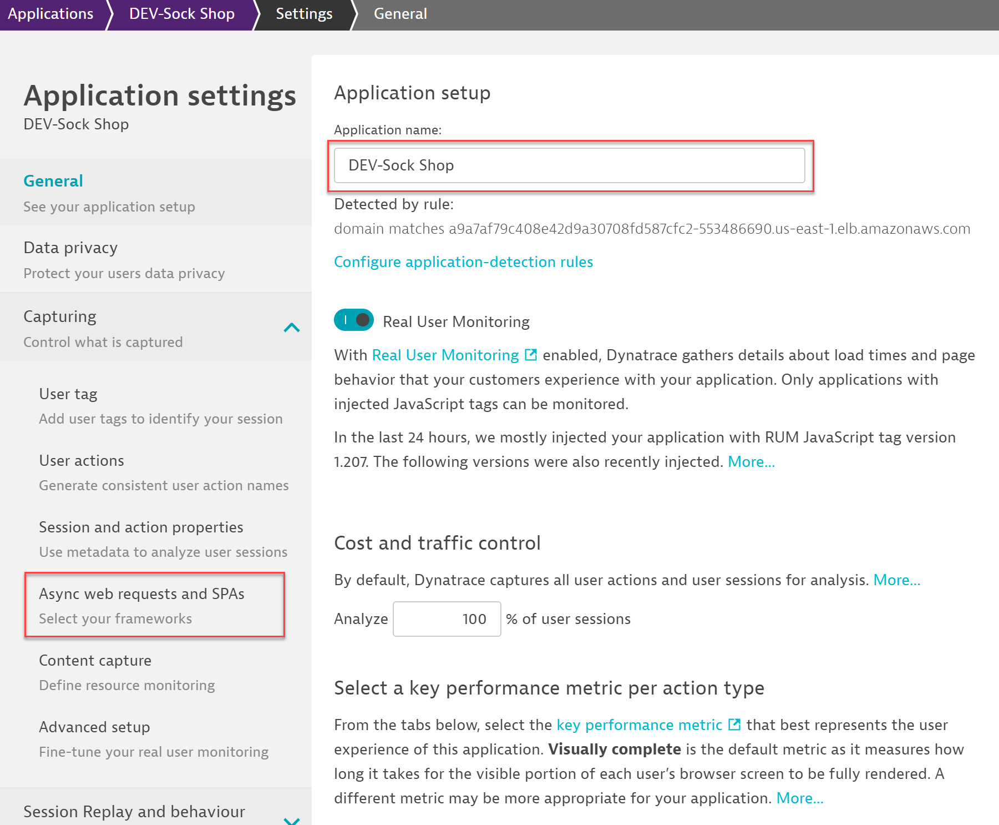
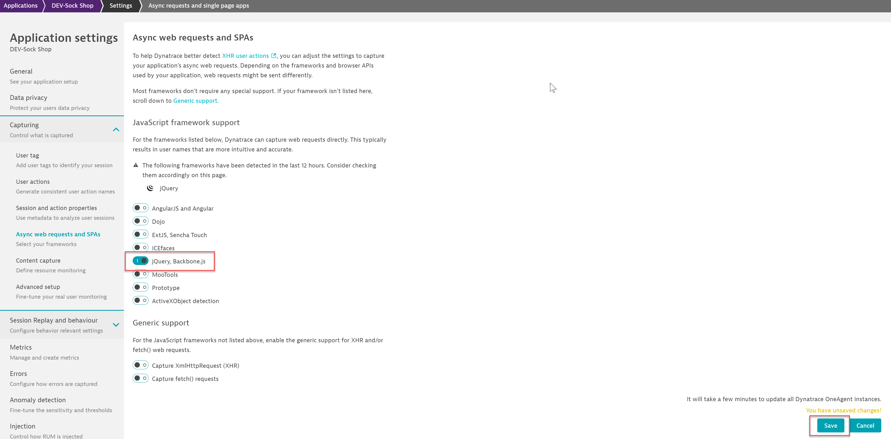
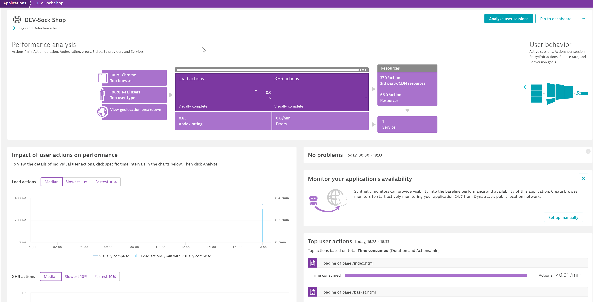

## BizOps Dashboard Configuration

This lab exercise will create a dashboard pack for the Sock Shop application that was deployed. In this exercise, we will utilize the Dynatrace BizOps Configurator that is publicly available on GitHub.

### Create API Token
1.  Navigate Settings>Integration>Dynatrace API
    - Click on "Generate Token"
 
 
 
2.  Enter "BizOps" for the token name. (See Screenshot Below)

3.  Toggle the switches on for the following, everything else shouldbe toggled off. (See Screenshot Below)
    - Access problem and event fees, metrics, and topology.
    - Read configuration
    - Write configuration
    - User sessions
    
4. Click Generate (See Screenshot Below)
   - Note if you don't copy it, you will lose access to visibility and will need to create a new one for security reasons.
 
  
  
5. Copy Token and place it in your notepad file - Failure to copy now may result in another creation because of security considerations.

  

### BizOps Configurator

1. Copy Dynatrace Tenant URL to notepad.
   - Remember the URL is unique to your environment
   - When copying to notepad, add https://YOUR_TENANT_URL/
  
   
   
4. Expand the domain and click on "Create New Application".

   
   
5. Click "Create"
   
   
   
6. Navigate back to Application in the Dynatrace menu and select Applications. Select the application you just created. You will see the application is named by the domain selected. Once you have selected the application, use the elypsis and select edit.

   
   
7. Rename the application to DEV-Sock Shope or PROD-Sock Shop depending what application environment you are setting up first. Remember the environment names were based on the domain names and that is why we are changing them. 
   - When finished with the new naming, select the menu item for "Async Web Requests and SPAs".

   

8. Dynatrace automatically detect the jquery framework. Toggle the switch for jquery to the on position. 
   - Click on "Save".

   
   
9. Visit the Sock Shop and run transactions

10. Navigate back to Applications on the Dynatrace menu and select the newly named application.
   - Repeat these same steps for creating the production application.
   
   

