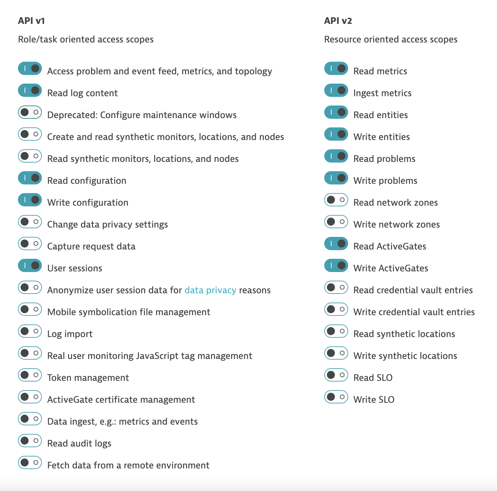

## Pre-Flight Checklist

	- TENANT="https://mytenant.live.dynatrace.com"
	- PAASTOKEN=myDynatracePaaSToken
	- APITOKEN=myDynatraceApiToken

1. Create an API Token.
	- [API Authentication](https://www.dynatrace.com/support/help/extend-dynatrace/dynatrace-api/basics/dynatrace-api-authentication/)
	
	
	
	
2. Create a PAAS token.
	- [PaaS Token](https://www.dynatrace.com/support/help/reference/dynatrace-concepts/environment-id/#anchor_paas)


## Run Shell command

	```bash
	()$ sudo bash -c './keptn-in-a-box.sh'
	```
	
You will need to provide the Tenant ID, API token, PaaS token and an Email.
For the class we will use the provided student account for the email.

	

Then answer 'Y' if the information is correct.


## Order App Overview

This application was built for demonstations of Dynatrace.  The front-end look like this.


The overall application is made up of four Docker components: a frontend web UI and 3 backend services.  Once monitored by Dynatrace, a multi-tier call flow will be available such as shown below.


### Pre-built Docker Images

The dt-orders application has pre-built problems programmed within different versions.  See source in the [dt-orders repo](https://github.com/dt-orders).  Each version for each service, has pre-built docker images that are published to [dockerhub](https://hub.docker.com/u/dtdemos).

This is a summary of the versions followed by a description of the problem scenarios.

| Service  | Branch/Docker Tag | Description |
|---|:---:|---|
| frontend | 1 | Normal behavior |
| catalog-service | 1 | Normal behavior |
| customer-service | 1 | Normal behavior |
| order-service | 1 | Normal behavior |
| customer-service | 2 | High Response time for /customer/list.html |
| order-service | 2 | 50% exception for /order/line URL and n+1 back-end calls for /order/form.html |
| customer-service | 3 | Normal behavior |
| order-service | 3 | Normal behavior |

## Problem Scenarios

### Deploy dtdemos/customer-service:2


## Deploy dtdemos/order-service:2 

Both these scenearios are enabled


and...


## Deployment

Below are two option to deploy the application:
* Using [docker-compose](docker-compose/README.md)
* Using [Kubernetes](k8/README.md)
