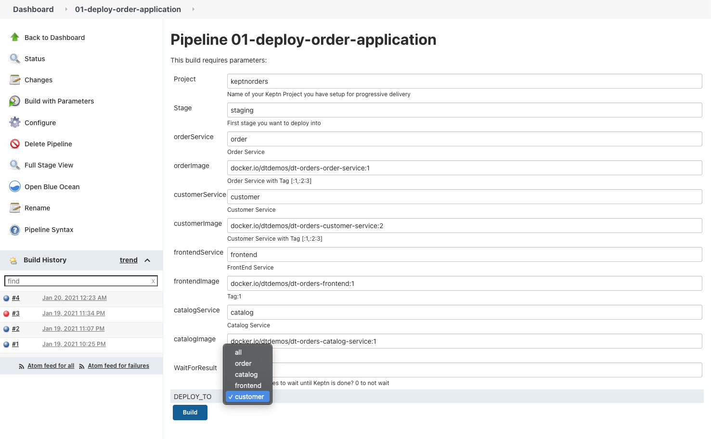

## Load Test Analysis Performance Issue

Learn how to use Dynatrace features that support Performance testing for each phase: scripting, analysis, and reporting

Now that we have our KIAB installed. 

Let's start by viewing a dashboard.

Click **"Dashboards"** from the Main Navigation menu.

Then Select the **"Autonomous Cloud Concepts with Keptn"** Dashboard.

Now you should see your Dashboard.

Next we will create a few configuration items and kick off a load test.

### Configuration

1.	Create a service tag
2.  Process Detection Naming rule
3.  Run first Load Test
4.  Describe Dynatrace Load Test Request Attribute
4.  Describe Calculated Service Metrics for Load Test Steps
5.  Kick off Keptn Customer 2 Build
6.  Update Keptn: keptnorders staging Management Zone
7.  Examine Performance Test Dashboard with Transaction Steps
8.  Load Test Performance Analysis

### Create Service tag

To support tagging, Dynatrace provides both a manual approach (Settings > Tags > Manually applied tags) and an automated, rule-based approach (Settings > Tags > Automatically applied tags).

We are going to apply a manual tag for this exercise.

First we need to create a tag on the service.
Navigate to **Transactions and services>frontend** 

We are looking for **frontend** with **keptnorders.staging.frontend [direct]**

Now we can create the **"evalservice"** tag.

### Create Process Group Naming Rule

Go to **"Settings>Processes and Containers>Process group naming"**

Then select "add new rule"

Now we will create the rule with the following parameters.

You can cut and paste these items.

* Rule name: **Keptn Processgroup Naming**
* Process group naming format: **{ProcessGroup:Environment:keptn_project}.{ProcessGroup:Environment:keptn_stage}.{ProcessGroup:Environment:keptn_service} [{ProcessGroup:Environment:keptn_deployment}]**
* Conditions: **keptn_deployment (Environment)**

Click **"Preview"** -> **"create rule"** -> **"save changes"**

### Kick off our first load test

Login to Jenkins

* username = keptn
* password = keptn

We are going to run the **03-simpletest-qualitygate pipeline**.
Click **"build"** this initial build will fail.
Refresh the page, now we can do a **"Build with Parameters"**

We need to change the Deployment URL

Click **Build**

### Describe Dynatrace Load Test Request Attribute

While executing a load test from your load testing tool of choice (JMeter, Neotys, LoadRunner, etc.) each simulated HTTP request can be tagged with additional HTTP headers that contain test-transaction information (for example, script name, test step name, and virtual user ID).

Dynatrace can analyze incoming HTTP headers and extract such contextual information from the header values and tag the captured requests with request attributes. Request attributes enable you to filter your monitoring data based on defined tags.

You can use any (or multiple) HTTP headers or HTTP parameters to pass context information. The extraction rules can be configured via **Settings --> Server-side service monitoring --> Request attributes**.

The header **x-dynatrace-test** is used one or more key/value pairs for the header. Here are some examples:

| **Key**   | **Description**   |
| --- | --- |
| VU  | Virtual User ID of the unique user who sent the request.  |
| SI  | Source ID identifies the product that triggered the request (JMeter, LoadRunner, Neotys, or other)  |
| TSN  | Test Step Name is a logical test step within your load testing script (for example, Login or Add to cart.  |
| LSN  | Load Script Name - name of the load testing script. This groups a set of test steps that make up a multi-step transaction (for example, an online purchase).  |
| LTN  | The Load Test Name uniquely identifies a test execution (for example, 6h Load Test – June 25)  |
| PC  | Page Context provides information about the document that is loaded in the currently processed page.  |

### Describe Calculated Service Metrics for Load Test Steps

Dynatrace automatically captures important metrics for services with no configuration required. Additionally you might need additional business or technical metrics that are specific to your application. These metrics can be calculated and derived based on a wide variety of available data within the captured PurePath. This allows you to further customize key performance metrics for which alerts should be generated and helps you keeping an eye on them by pinning them to your dashboards.

For Performance Testing you can use Calculated service metrics to track your Performance transaction steps.   These can be used in Dashboards and alerting during the Performance Test but also can be used in analysis after the Performance test is complete. 

### Kick off Keptn Customer 2 Build

Click on **01_deploy_order_application** pipeline

Now we are going to push the **customer** version **2**.

Select **"Build with parameters"**

Then we need to change the build for customer to version 2 and select the build for **Customer**

### Update Keptn: keptnorders staging Management Zone

Each customizable management zone comprises a set of monitored entities in your environment, be it hosts that share a common purpose, a specific application, a staging environment, or services of a certain technology. Management zones may overlap, just as team responsibilities often overlap. Users may be granted access to entire environments, a specific management zone, or a subset of related management zones.

This exercise shows how to update a management zone that will be used in dashboards to show process and host metrics for analysis.

In Dynatrace on the navigation menu, navigate to **settings --> preferences --> management zones**

Click **Keptn: keptnorders staging** management zone and add a new rule with configuration as show below.

- Rule applies to Process groups
- Process group name begins with = keptnorders.staging
    

Select **apply to underlying hosts of matching process groups** check box.

Click the **preview** button to verify.

Save the zone. Click **create rule** button. Then **Save changes** button.

### Examine Performance Test Dashboard with Transaction Steps

We have provided a **Performance Test Dashboard with Transaction Steps** in your environment.   This dashboard provides a complete overview for your Performance Test focusing on SLIs (Latency, Traffic, Errors & Saturation).  Included in this dashboard is the following: Health Status, Transaction Steps Scorecard, Services Overview,  Database Overview,  Process Overview and Hosts Overview.   This dashboard also provides quick analysis links.  

Click **"Dashboards"** from the Main Navigation menu.

Then Select the **Performance Test Dashboard with Transaction Steps** Dashboard.

### Load Test Performance Analysis

There are different ways to analyze the data. Your approach should be based on the type of performance analysis you want to do (for example, crashes, resource and performance hotspots, or scalability issues). Following is an overview of some useful approaches you can follow to analyze your load tests. Of course, any Dynatrace analysis and diagnostic function can be used as well

**Response Time Analysis**

On the Response time analysis page you see the average response time observed during the analyzed timeframe. On the left side of the infographic, under Distribution, you can see how much time is contributed by calls to other services, calls to databases, and code-level execution. On the right side, under Top findings, we list the biggest hotspots identified by Dynatrace. You can click any of these entries to view further details.

**Compare**

The Compare view enables you to compare critical service-request metrics (Response time, Failures, CPU, and Load) between two load tests. Compare view includes a header that contains filters and a comparison time-frame picker that you can use to select a time frame for comparison (options include 2 hours before, day before, week before, and custom time frame).

The charts in compare view are interactive. Click into a chart and drag to adjust the comparison time frame. You can also zoom in/out of the base chart on the left and/or select specific performance percentiles for comparison (Median, Slowest 10%, and Slowest 5%).

The Compare view example below compares performance metrics across two time frames. The base chart on the left shows up-to-the minute performance measurements. The compare chart on the right shows the performance of the same service hours earlier on the same day, when a serious performance problem was encountered. Both Response time and Failures all spiked during the compare time frame.

**Architecture Validation - Service Flow**

As testers, we typically only test against the service endpoint. As performance engineers we should however understand what happens end-to-end with that request. Which other services does it call? How many round trips to the database does it make? Does service load balancing and failover work correctly? Do the caching layers work well? And do we have any bad architectural patterns such as a data-driven N+1 query problem?

In Dynatrace, we analyze the Service Flow which shows us the full end-to-end flow of every request executed against our service endpoint. You can also apply filters to only focus on a particular test transaction, a specific time frame or compare the flow of failing vs non- failing transactions.

