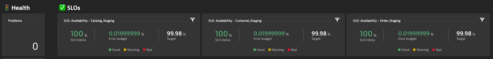

## SLOs and Load Test Analysis Error Issue

THe Google’s SRE Handbook mostly focuses on the production use case for SLIs/SLOs, Dynatrace is “Shifting-Left” this approach and using SLIs/SLOs

While an SLI is just a metric, an SLO just a threshold you expect your SLI to be in and SLA is just the business contract on top of an SLO. It’s great that this discipline and ideas have got a lot of attention lately.

“The earlier in the lifecycle we ensure SLIs meet their SLOs the better it will to ensure these service levels in production”.

In this lab we walk through how to create SLOs in Dynatrace that can be used in your Performance Testing and we will also troubleshoot why a Availability/Error SLO failed.

### Configuration

1.  Create a Availability/Error SLOs
1.  Kick off Keptn Orders 2 Build
1.  Run Load Test
1.  Examine Performance Test Dashboard with Transaction Steps & SLOs
1.  Load Test Availability/Error Analysis

### Create a Availability/Error SLOs

The Dynatrace Software Intelligence Platform delivers all the necessary Service-Level Indicators (SLIs) for defining your Service-Level Objectives (SLOs) and monitors the status and error budgets of those objectives. Whether you want to define an SLO for real user experience or for measuring your service availability, your Dynatrace monitoring environment already comes with the right tools for your Site Reliability Teams. You can get all the facts about the health of you critical business services with respect to Business and Service-Level Objectives (SLO), Service-Level Agreements (SLAs), and end-user experience

Click "**SLOs**" from the Main Navigation menu.

Then Select the "**Add new SLO**" Button.

This will bring up the **Add new SLO** wizard screen.

Click on the **Service-level availability** button.

In the Name this service-level availability slo add this name:  **Availability - Order_Staging**

Click **Next** at the button right of the screen.

In a new tab open you Orders Staging Service.  In the URL bar copy the service_id in notepad.

Go back to your SLO Wizard screen and then add the below filter.  Make sure the change the text in the entityId with what you copied to Notepad.

type("SERVICE"),entityId("**OrderSericeIdYouCopiedtoNoatedGoesHere**")

Then click the **Verify Button**

### Kick off Keptn Orders 2 Build

### Run Load Test

### Examine Performance Test Dashboard with Transaction Steps & SLOs

We have provided a **Performance Test Dashboard with Transaction Steps & SLOs** in your environment.   This dashboard provides a complete overview for your Performance Test focusing on SLIs (Latency, Traffic, Errors & Saturation).  Included in this dashboard is the following: Health Status, SLOs, Transaction Steps Scorecard, Services Overview,  Database Overview,  Process Overview and Hosts Overview.   This dashboard also provides quick analysis links.  

Click **"Dashboards"** from the Main Navigation menu.

Then Select the **Performance Test Dashboard with Transaction Steps & SLOs** dashboard.

### Load Test Availability/Error Analysis