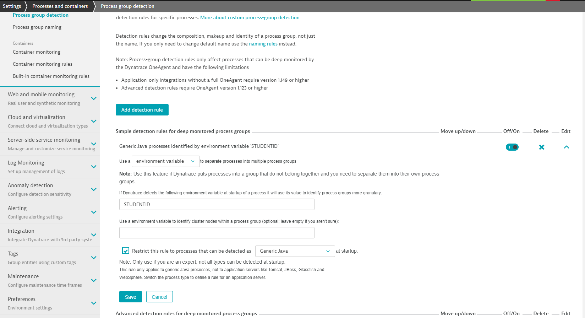

# Welcome to Progressive Delivery & Release Management HOTWEEK

This repository contains 3 major assets

## 1: CodeLab instructions

As you are going to run through this HOT (Hands-On-Training) you will walk through the instructions on Dynatrace University powered by CodeLab!
The markdown for CodeLab and the images can be found in the content and assets folders!

## 2: Setup Scripts

Here are the setup instructions for the training environment. If you do this as part of HOTWEEK this these steps have already been done for you. If you want to standup your own environment feel free to use the same steps!

**This HOT requires**
1. A k8s cluster 
1. A Dynatrace Tenant
1. A Linux Bastion Host with kubectl connected to your k8s cluster

**Environment Variables**
We need 3 environment variables
* DT_TENANT: hostname of your SaaS or managed environment, e.g: abc12345.live.dynatrace.com
* DT_API_TOKEN: It needs configuration read/write access. Best is to give it all privileges that don't touch sensitive data
* DT_PAAS_TOKEN: A PAAS Token as the script also installs a OneAgent & ActiveGate on your Bastion Host

So - we start with
```console
$ export DT_TENANT=yourtenant.live.dynatrace.com
$ export DT_API_TOKEN=YOURAPITOKEN
$ export DT_PAAS_TOKEN=YOURPAASTOKEN
```

**Clone this repo**
This repo contains a setup folder with all the necessary setup scripts. So - we start by cloning this repo
```console
$ git clone https://github.com/Dynatrace/perform-2021-hotday/
$ cd perform-2021-hotday/progressivedelivery/setup
```

**Finalize Bastion host**
The first script will finalize installation of the bastion host and also installs Istio. At the end of the run you will get the hostname of Istios Ingress LoadBalancer that was created. Depending on your cloud provider the ask is to setup a wildcard DNS for that hostname.

```console
$ ./1_bastionandistio.sh
```

**Create your wildcard DNS pointing to the Istio Ingress**

Now its time to setup the DNS and export that DNS in the K8S_DOMAIN env-variable

```console
$ export K8S_DOMAIN=yourk8sdomain
```

**Finish Installation**
Now we just run the rest of the scripts. The last one will print out all details you need to know about the environment that was just created!

```console
$ ./2_monitork8s.sh
$ ./3_keptndynatrace.sh
$ ./4_dynatraceconfig.sh
$ ./5_gitea.sh
$ ./6_outputsetupinfo.sh
```

## 3: Finalize Dynatrace configuration

While almost everything in this setup is automated through the scripts, API calls and using Dynatrace Monaco - one step has to be done manually as there is currently no API for it. Its the setup of a **Process Group Detection** rule for the sample Java application as shown in the following screenshot:


## 4: Hands-On Tutorial Scripts

For some of the Hands on Tutorials the trainees need to e.g: deploy a new version of a microservice.
To make this easier we have created a set of scripts that are prefixed with hot_xxx.sh. Here is an overview:


| Script | Description |
| ----- | ---------|
| `hot_createkeptnproject.sh` | Will create a new keptn project for 3 stage delivery, initialized with helm chart for the simplenodeservice, jmeter tests and a monaco config for automating synthetic tests |
| `hot_deletekeptnproject.sh` | Will delete an existing Keptn project |
| `hot_deploy.sh` | Instructs Keptn to start the delivery process of a new version |
| `hot_getinfo.sh` | Will output all relevant links for your Keptn environment, e.g: bridge, user, password, ... |

Here is an example flow of calls:
```console
$ ./hot_getinfo.sh
Lists links of your Keptn Bridge, Username, ...

$ ./hot_createkeptnproject.sh student001
Will create keptn project with name student001

$ ./hot_deploy.sh student001 1
Will deploy version 1 of the sample service for student001

$ ./hot_deletekeptnproject.sh student001
Will delete the keptn project
```

