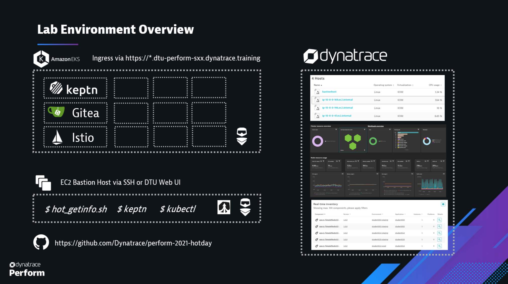

## Lab Environment

This lab will teach you how to leverage Dynatrace Cloud Automation to track the quality of your releases.
The lab we are providing as part of the Hands-On-Training session looks like this:

### Run the lab yourself

For detailed information on how to run the lab yourself please look at the [GitHub repo's readme](https://github.com/Dynatrace/perform-2021-hotday/tree/main/progressivedelivery)

Here the quick overview:

**You need**
1. A k8s cluster
2. A Dynatrace Tenant
3. A host that is connected to the internet and connected to the k8s cluster

**To setup**
To install the lab environment on your k8s:
1. Clone the github repository on your host
2. Execute all scripts under the setup folder!

After that you are good to go to continue with the lab