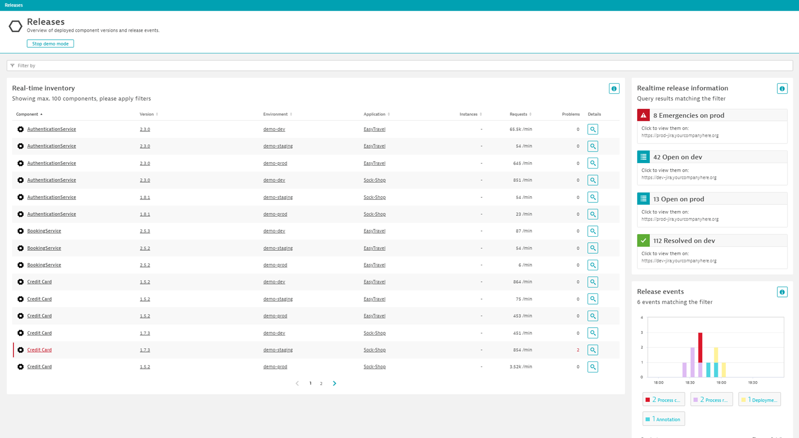

## Introducing Dynatrace Release Inventory

Dynatrace is aimed to help you with answering the question: **Release or not to release?**

In this module, you will explore the new *Release Inventory* view in Dynatrace using the Demo Mode data.

You will learn how this screen helps you answer important questions such as
* Which services are deployed in which environments?
* Which versions of each service is running where?
* Are there any problems with a particular service or version?
* When were the last deployments of a particular service?
* Are there any open tickets for a specific service?

### Prerequisites

- Access to the _Dynatrace Tenant_

### Feature background

The *Releases* menu item is as of creating this tutorial (December 2020) only accessible through a Preview program. You therefore may not see it yet in your own Dynatrace enviornment.
