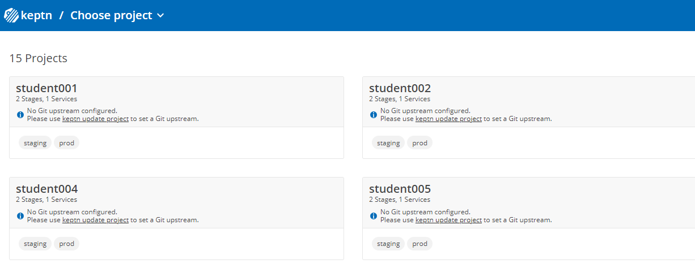
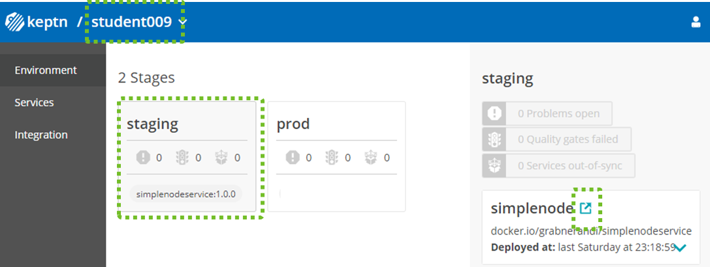
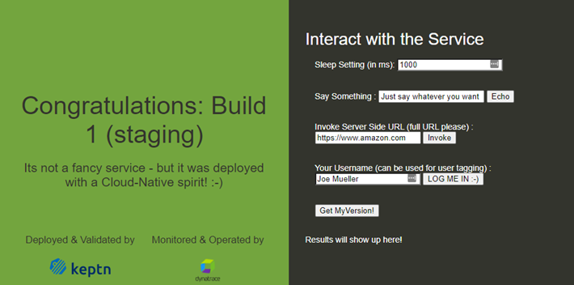

## Deploy a Microservice with Keptn

In your bastion host navigate to the directory ~/perform-2021-hotday/progressivedelivery. This directory contains all files relevant for the complete hotday.

```bash
(bastion)$ cd ~/perform-2021-hotday/progressivedelivery
```

There are several bash scripts prefixed with *hot_* that we will be using for our excercises when deploying apps.
Lets execute hot_getinfo.sh as it will give us all relevant informaiton and links for our excercises:
```bash
(bastion)$ ./hot_getinfo.sh
===============================================================================
Here are all the useful URLs and tokens you will need for the HOTDAY
===============================================================================
Keptn Bridge URL: http://keptn.xxxx.dynatrace.training/bridge
Keptn Bridge Username / Password: admin / YYYYYYYYYYYYYYYYYYYYY
Deployed services will be available under
  - Staging:    http://simplenode.studentxxx-staging.keptn.xxx.dynatrace.training
  - Production: http://simplenode.studentxxx-prod.keptn.xxx.dynatrace.training

===============================================================================
Dynatrace Tenant Url: https://abc12345.sprint.dynatracelabs.com
Dynatrace Username / Password: see it in Dynatrace University

===============================================================================
For some of the excercises you need the Dynatrace API token in the DT_API_TOKEN Env Variable
To get this - simply run the following command:
export DT_API_TOKEN=YYYYYYYYYYYYYYYYYYY
```

Every student in the HOT class was assigned an id which we will use to differentiate our deployments. We have ids such as "Student001", "Student002", ...
If your StudentID showed up as empty in the output of hot_getinfo.sh then set it to the name you were given by the trainer
```bash
(bastion)$ export STUDENTID=studentxxx
```

You can run hot_getinfo.sh to validate!

### Step 1: Create Keptn Project

In our HOT class we are using Keptn (www.keptn.sh) to deploy a microservice in a staging and then production environment.
If you want to learn more about Keptn feel free to look at https://tutorials.keptn.sh or watch some of the [Keptn related Dynatrace Performance Clinics on YouTube](https://bit.ly/oneagenttutorials)

Keptn is organized in projects and our goal is for every student to create a Keptn project using the Student ID as the project name.
To make things easier we can execute the hot_createkeptnproject.sh script like this:
```bash
(bastion)$ ./hot_createkeptnproject.sh $STUDENTID
```

This will take a couple of seconds - but - once done we should be able to see the Keptn project in the Keptns Bridge.
You get the Keptn's Bridge URL, username and password from the hot_getinfo.sh output!




### Step 2: Deploy version 1

As we have a Keptn project that is configured for staging and production we can start deploying version 1 of our sample node.js based microservice.
We can use the script hot_deploy.sh by passing in our studentid and the version we want to deploy. We start with version 1 which means we can call the script like this
```bash
(bastion)$ ./hot_deploy.sh $STUDENTID 1
```

The first deployment will take about a minute or two as Keptn internally uses Helm for deployment and it needs to do some initialization work.
Once the script completes we can validate in the Keptns bridge on whether the service was deployed into staging. Simply click on your project and explore the environment screen where you get an overview of all deployments per stage.



You can also open the link to the deployed service right next to the name *simplenode* as highlighted in the screenshot above.
The application is not fancy - but - it does its job for our purpose



### Step 3: Exploring whats deployed on k8s

Keptn is really just used to safely deploy our microservice into k8s. Keptn automatically creates namespaces for each stage in each project to ensure that all our services are nicely separated. To see what this looks like we can execute a kubectl get ns that will list all namespaces:
```bash
(bastion)$ kubectl get ns
NAME                 STATUS   AGE
default              Active   6d16h
dynatrace            Active   5d6h
istio-system         Active   6d16h
keptn                Active   6d16h
kube-node-lease      Active   6d16h
kube-public          Active   6d16h
kube-system          Active   6d16h
student001-prod      Active   4d18h
student001-staging   Active   4d18h
student002-prod      Active   4d
student002-staging   Active   4d
student003-prod      Active   4d
student003-staging   Active   4d
...
```

The interesting ones are our studentxxx-staging and studentxxx-prod. If you want to see more feel free to get the list of pods in your specific namespaces:
```bash
(bastion)$ kubectl get pods -n studentxxx-staging
```

### Step 4: Keptn pushes version to production

After deploying the service into staging Keptn first executes some tests and then evaluates both test results and SLOs (Service Level Objectives).
If the SLOs are met Keptn will promote this version to production. The goal of this HOT class is not to explore Keptn - but - if you are interested walk through some of the tutorials on https://tutorials.keptn.sh

For now - we are done here as our main objective is not Keptn - but seeing how Dynatrace now helps us understand who deployed which service in which version into which environment!