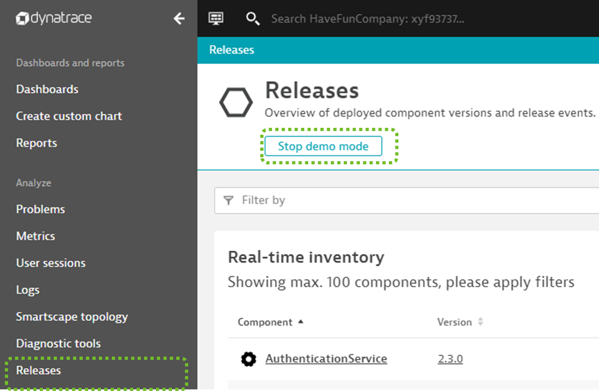

## Exercise on Live Data

As every student just started deploying a microservices into k8s which is monitored by Dynatrace we should soon start seeing an overview of all deployed services in the Dynatrace Release Inventory screen.

To explore that data lets navigate back to the Release view in Dynatrace and now turn off Demo Mode!

What we should see is a list of all monitored process group instances that reflect the deployed microservices. Each entry in the table should also show the actual version, environment and application next to it.

The way things are set up right now is that environment reflects the k8s namespace, e.g: student004-staging where the application reflects the keptn project, e.g: student004
This information is extracted from metadata that Dynatrace OneAgent extracts from the monitored processes or from deployment events. More on this in the next chapter.

### Exercise
Before we go on - lets answer a couple of questions based on live data. Can you find out
1. How many students have already deployed into staging?
1. Has anyone already deployed into production?
1. Did everyone follow instructions and deployed version 1?
