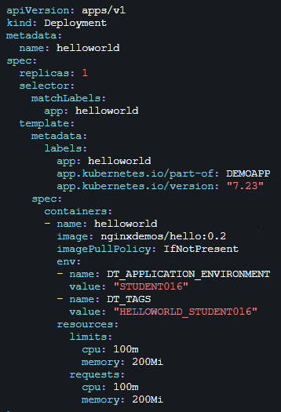
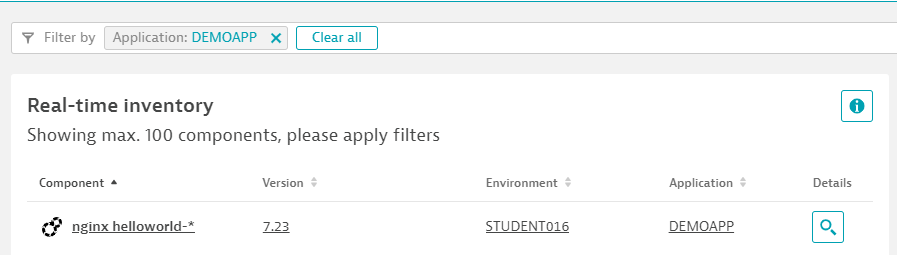

## Deploy Hello World with kubectl

In our previous example Keptn took did all the work for us to deploy our microservices by applying pre-configured Helm charts.
Now we want to deploy a Hello World container ourself - using kubectl directly by applying a k8s deployment configuration.
This will allow us to play around with the k8s annotations as well as with environment variables and see how Dynatrace is picking up this meta data to show in the *Real time inventory*

### Step 1: Explore and edit deployment.yaml

In the subdirectoy helloworldk8sdeploy you will find a file called **deployment.yaml**
Lets edit that file using vi:
```bash
(bastion)$ vi helloworldk8sdeploy/deployment.yaml
```

You can see the two annotations for **Version** (version) and **Application** (part-of) and also one of the specific DT_APPLICATION_ENVIRONMENT environment variables that will define the **Environment**
Feel free to make modifications to that file, e.g: change the version, or application. Put in your StudentID in the DT_APPLICATION_ENVIRONMENT variable as well as in DT_TAGS as this will later also help us easier identify our container in Dynatrace.
**Tip for novice vi users:** To start editing simply press the key 'i' which will put the editor into 'insert' mode!



Once done you can save the file.
**Tip for novice vi users:** To save and exit press the ESC key. Then enter ':wq!'. This will write the changes and then quit the editor!

### Step 2: Deploy in your own staging namespace

Now we can apply that deployment description. In order to separate our deployments we will simply apply that configuration in our respective existing staging namespace. So - if you are student001 you would deploy into student001-staging! 
To do that we execute the kubectl apply command where we pass the target namespace as parameter. Here is the example for student016 - but - make sure you put in your correct student id!

```bash
(bastion)$ kubectl apply -n student016-staging -f helloworldk8sdeploy/deployment.yaml
deployment.apps/helloworld created
```

It should say "deployment.apps/helloworld created". If not then please check the error message. Double check your deployment.yaml file for correct spacing and quotes. Also make sure that you didn't misspell your namespace name.

We can also validate that everything worked as expected by looking at the running pods in our namespace. Here the example for student016-staging (again - make sure you use your `studentid`):
```bash
(bastion)$ kubectl get pods -n student016-staging
NAME                          READY   STATUS    RESTARTS   AGE
helloworld-7b7c586b78-mxntv   1/1     Running   0          106s
simplenode-54f6d97477-vjgnt   1/1     Running   0          59m
```

We see that besides our simplenode that was deployed by Keptn we also now see our helloworld.

### Step 3: Validate in Dynatrace Release Inventory

If we have done everything right we should see our recent deployment show up in Dynatrace. Go ahead and explore the *Real time inventory* and filter on the Application with the name "DEMOAPP" (or whatever value you gave it)!
Here is what we should see!



### Step 4: Change and Redeploy

Now - go ahead and edit deployment.yaml once again. Change any of the fields, save the file and reapply using the same kubectl apply command line.
After about 60s you should see your new deployment version in Dynatrace!