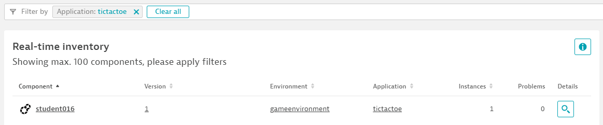

## Deploy TicTacToe Java Console App

I hope you keep having fun. Now we are really going to have fun as we are going to deploy a little Game :-)

### Prerequisits

The sub-directory *tictactoejava* holds a TicTacToe console app. Its very simply but it allows us to also show how Dynatrace can detect version, application and environment for any type of process. In our case its a Java Process.

As we all run on the same bastion host we want to make sure that Dynatrace uniquely identifies our Java Processes as separate Process Groups. 
For that its required that we have our STUDENTID environment variable exported. We have validated this earlier - but - lets double check

```bash
echo $STUDENTID
```

If that comes back blank please do (where XXX is your studentID)
```bash
export STUDENTID=studentXXX
```

### Step 1: Lets Play TicTacToe

Before launching our app we want to make sure we set our 3 DT-specific environment variables so that Dynatrace automatically picks up **Version**, **Application** and **Environment**. 
Additionally we set DT_TAGS which will make it easier for us later on to find our process group!

**Tip**: In case we have set DT_TENANT env variable earlier we must make sure to clear it as this may impact the OneAgent that monitors our Java process.

So - here are the commands we execute (where XXX is your studentID):
```bash
$ cd tictactoejava
$ unset DT_TENANT
$ export DT_APPLICATION_RELEASE_VERSION=1
$ export DT_APPLICATION_NAME=tictactoe
$ export DT_APPLICATION_ENVIRONMENT=gameenvironment
$ export DT_TAGS=tictactoe_$STUDENTID
$ java TicTacToeAI

Welcome to the Tic Tac Toe game.
Enter your move with coordinates. Your input should be two integers separated by a space.
You will be playing against the computer.

     |     |     
- - -|- - -|- - -
     |     |     
- - -|- - -|- - -
     |     |     

Enter X, Y coordinates for your move separated by a space: 1 1
  X  |     |  O  
- - -|- - -|- - -
     |     |     
- - -|- - -|- - -
     |     |     

Enter X, Y coordinates for your move separated by a space: 
```

Now - play at least one game. May the better human win :-)


### Step 3: Validate in Dynatrace Release Inventory

If we have done everything right we should see our recent deployment show up in Dynatrace. Go ahead and explore the *Real time inventory* and filter on the Application with the name "tictactoe" (or whatever value you gave it)!
Here is what we should see!



### Step 4: Restart with different environment variables

If you want to play more feel free to re-launch the game - but - before you do - try it with e.g: a different version by exporting DT_APPLICATION_RELEASE_VERSION=2
Its up to you how often you want to do this. If you give this a try make sure to validate that Dynatrace also correctly picks it up