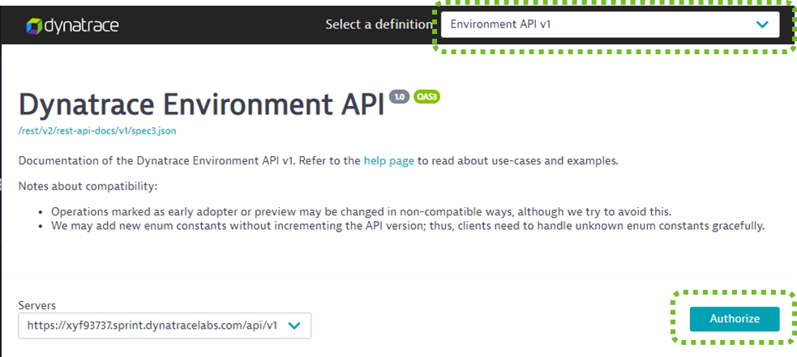
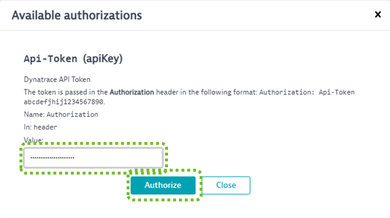

## Open Swagger UI

In the Dynatrace Web UI you can access the Swagger UI via **Settings->Integration->Dynatrace API** and then click on the **Dynatrace API Explorer** link on the top.
In the browser then switch to the **Environment API v1** (top right) and click on **Authorize**

Then paste the API Token into the field and click **Authorize**

