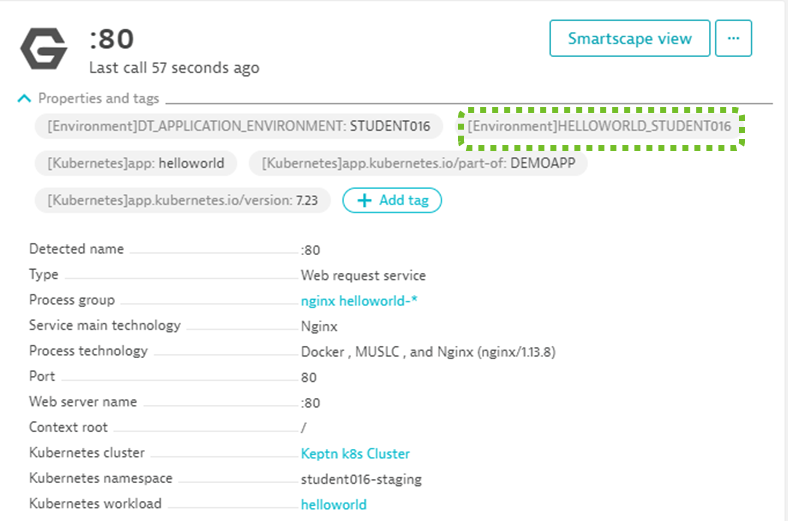
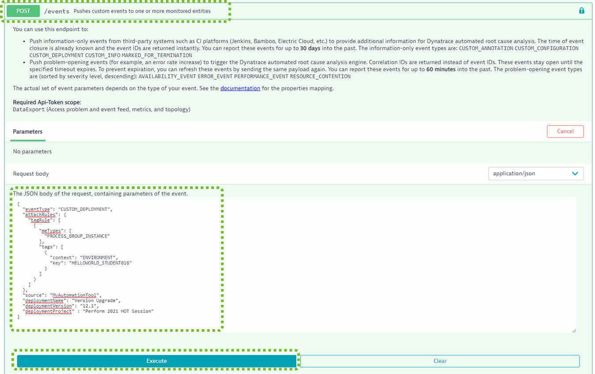
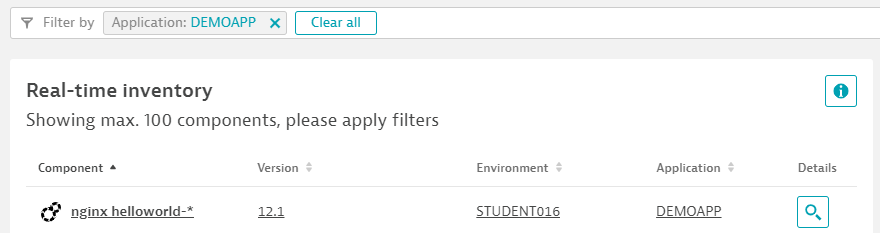

## Send Deployment Event

In our previous excercises we deployed TicTacToe as well as our HelloWorld app. We passed version information through the k8s labels and environment variables.
Now we want to explore the third option to pass version information to Dynatrace's *Real time inventory* by sending a deployment event to our Process Group Instances for tictactoe or Helloworld

### Step 1: Hello World Version

When we deployed the Hello World app we set the DT_TAGS environment variable to HELLOWORLD_STUDENTxxx. If you explore your Process Group Instances or your Services and filter by the Enviroment tag HELLOWORLD_STUDENTxxx you can find it easily:



Now we can easily send a custom deployment event to our specific Hello World Instance by identifying it via this tag. The following is the HTTP POST BODY for the Events API Call.

```json
{
  "eventType": "CUSTOM_DEPLOYMENT",
  "attachRules": {
    "tagRule": [
      {
        "meTypes": [
          "PROCESS_GROUP_INSTANCE"
        ],
        "tags": [
          {
            "context": "ENVIRONMENT",
            "key": "HELLOWORLD_STUDENTXXX"
          }
        ]
      }
    ]
  },
  "source": "MyAutomationTool",
  "deploymentName": "Version Upgrade",
  "deploymentVersion": "12.1",
  "deploymentProject" : "Perform 2021 HOT Session"
}
```

You can copy/paste the above and put it in your Swagger UI for the POST Event API Call. Just make sure you select the correct StudentID.



### Step 2: Validate Version in Release Inventory

Now lets validate if the version we specified in the event is also the one shown in the Release Inventory view:

