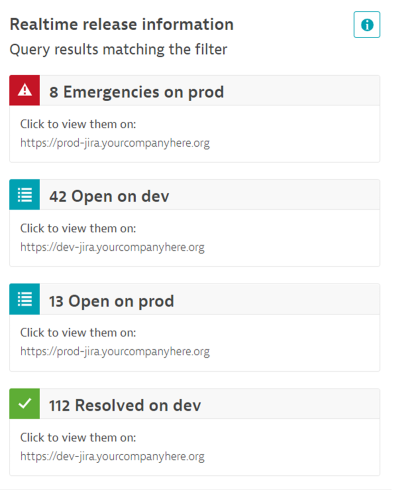

## Issue Tracking Integration

Dynatrace shows issue statistics related to the monitored entities in the Real-time inventory on the Releases page. For example, if the real-time inventory shows entries for an application Sock-Shop with version 1.7.3, the issue tracker integration will provide the count of bugs for Sock-Shop version 1.7.3.

This information in the context of your release inventory gives you more data in a single spot to make better decisions around: **Release or not to release?**

**CAUTION**: Until Dynatrace 209 there is no server-side caching of issue tracking query results. This means that everytime the Release Inventory screen is refreshed Dynatrace will send queries to the configured issue tracking systems. Its therefore possible that due to the amount of queries within a minute we will run into rate-limits on the APIs of GitHub or Jira which means not all of us may see accurate data! With 210 a caching mechanism is implemented that prevents this problem!

In this module, you will learn how to
1. Setup the issue tracker integration for GitHub or Jira
2. Explore issue statistics in the release inventory

